# GitOps deployment

This repository supports both Argo CD and Flux. Each controller reconciles the
same application-owned Helm chart and production values:

- chart: `.helm/`
- release values: `.helm/values-production.yaml`
- Argo CD entrypoint: `deploy/argocd/`
- Flux entrypoint: `deploy/flux/`

Run `pnpm nrb init --name ... --domain ... --owner ...` before configuring a
cluster. Initialization replaces the template repository owner, product slug,
namespace, registry path, and all public domains in these files. A manifest that
still contains `your-github-org`, `example.com`, or
`sha-REPLACE_WITH_RELEASE_GIT_SHA` is intentionally not deployable.

## Ownership boundary

The application repository owns image references, Helm templates, application
configuration, migration hooks, Services, probes, ingress routes, and Secret
references. A platform/config repository should own cluster creation, controller
installation, controller RBAC/projects, secret backends, ingress controllers,
DNS/TLS issuers, databases, observability infrastructure, and disaster recovery.

For a simple single-cluster setup, the manifests in this repository can be
applied directly. Larger installations should copy or reference them from the
platform repository and pin the application source to a reviewed branch, tag, or
commit according to the promotion policy.

## Release and promotion flow

```mermaid
flowchart LR
  merge[Merge application code] --> tag[Create reviewed release tag]
  tag --> plan[Release workflow derives affected images from Nx and migration paths]
  plan --> images[Build, scan, sign, and publish only selected immutable images]
  images --> promote[Run Promote GitOps release with the full 40-character Git SHA]
  promote --> verify[Verify digest, signature, scan, SBOM, provenance, and render Helm]
  verify --> pr[Open a promotion pull request updating values-production.yaml]
  pr --> reconcile[Merge after CI; Argo CD or Flux reconciles]
```



The promotion workflow is manual by design. It:

1. accepts only a full 40-character commit SHA already contained in `main`;
2. resolves only images published for that SHA and verifies the immutable
   digest, keyless release-workflow signature, signed SPDX SBOM, SLSA
   provenance, and passing Trivy scan attestation;
3. updates those Helm image references to the exact `sha-<40-character-sha>`
   tag plus digest, leaving unaffected workloads on their previously promoted
   digest;
4. requires the first promotion to provide every release-owned image, so no
   template placeholder can reach a cluster;
5. renders the chart and validates both GitOps controller manifests;
6. pushes `release/gitops-sha-<full-sha>` with the repository owner identity and
   opens a pull request.

It never commits directly to `main`, never shortens the image tag, and never
creates a CI/deploy commit loop. Configure `GH_DEPLOY_TOKEN` with repository
contents, pull-request, and package read access before using the workflow.
Promotion fails when an image merely exists in the registry without all signed
evidence or when the signing certificate does not name the exact repository,
release workflow, and requested source SHA.

The release planner uses Nx's affected graph for application images and a
separate migration-path rule for the migration image. A full build remains the
safe default for the first promotion, Dockerfile/workspace changes, or an
explicit `force_full` dispatch; otherwise the workflow primes one shared
BuildKit dependency cache and builds only the selected image targets.

## Common prerequisites

- a Kubernetes cluster compatible with the selected Helm version;
- release images published under full-SHA tags by
  `.github/workflows/release-images.yml`; promotion pins selected workloads to
  their registry digest automatically;
- a target namespace Secret named by `secrets.existingSecret` containing at
  least `SESSION_SECRET` and `DATABASE_URL`;
- `ghcr-credentials` in the target namespace when images are private;
- reachable PostgreSQL and Redis services;
- ingress, DNS, and TLS configured for every enabled application domain.

The current manifests use the stable APIs documented by each controller:
`argoproj.io/v1alpha1` Application, `source.toolkit.fluxcd.io/v1`
GitRepository, and `helm.toolkit.fluxcd.io/v2` HelmRelease.

## Validate before applying

```bash
pnpm run deploy:validate:gitops
kubectl kustomize deploy/argocd >/dev/null
kubectl kustomize deploy/flux >/dev/null
```

`deploy:validate:gitops` performs strict Helm lint/render validation, checks the
Argo CD and Flux contracts, and renders both Kustomize entrypoints. It does not
contact or mutate a cluster.

## Argo CD

Install and configure Argo CD through the platform layer, then apply the
application:

```bash
kubectl apply -k deploy/argocd
argocd app get nest-react-boilerplate
argocd app wait nest-react-boilerplate --health --timeout 600
```

The Application tracks `main`, enables prune and self-heal, creates the target
namespace, and retries transient sync failures. For a private Git repository,
configure repository credentials in Argo CD; do not add credentials to this
manifest.

The optional `.github/workflows/argo-sync.yml` is a manual operational shortcut.
It uses a version-pinned, checksum-verified Argo CD CLI and requires
`ARGOCD_SERVER` plus `ARGOCD_AUTH_TOKEN` repository secrets.

## Flux

Install Flux through the platform layer, then apply the source and release:

```bash
kubectl apply -k deploy/flux
flux get sources git -n flux-system
flux get helmreleases -n flux-system
flux reconcile helmrelease nest-react-boilerplate -n flux-system --with-source
```

The GitRepository tracks `main`. The HelmRelease reads `.helm/`, merges
`values.yaml` with `values-production.yaml`, creates the application namespace,
waits up to ten minutes, retries failed installs/upgrades, and rolls back failed
upgrades. For a private repository, add a same-namespace `secretRef` through the
platform overlay instead of committing credentials.

## Secrets and image pulls

The chart consumes an existing Secret through `secrets.existingSecret`; it does
not own production secret values. Provision that Secret with External Secrets,
Vault, SOPS, Sealed Secrets, or the platform's equivalent. The Secret must exist
before the migration hook and application pods run.

Production values reference `ghcr-credentials`. Create it through the platform
secret flow, or remove the pull-secret reference when every image is public.

## Verification and rollback

After reconciliation:

```bash
kubectl get pods,job,svc,ingress -n nest-react-boilerplate
kubectl rollout status deployment/nest-react-boilerplate-auth-app-api -n nest-react-boilerplate
curl -fsS https://auth-app-api.example.com/ready
```

Rollback is Git-driven: revert the promotion pull request or promote a previous
verified image SHA, merge the change, and let the controller reconcile. Database
schema changes must remain backward-compatible across the rollback window. When
they are not, restore a verified backup or roll forward with a corrective
migration before returning application traffic.

Do not use the controller's imperative rollback as the lasting state; record the
same rollback in Git so reconciliation does not reapply the failed version.
