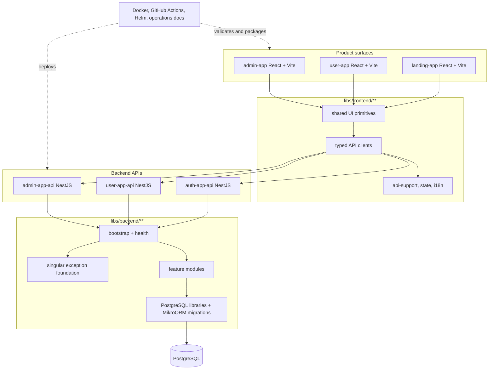

# Nest React Boilerplate

A production-oriented Nx monorepo starter for teams building React frontends and NestJS APIs on PostgreSQL. It packages three React apps, three NestJS APIs, shared platform libraries, OpenAPI-driven clients, database migrations, Docker Compose stacks, and GitHub Actions quality gates.

## System at a glance



Start here when evaluating the repo, then use the linked deep dives for architecture, API lifecycle, local verification, and operations.

## Tech stack

| Area          | Choices                                                                                     |
| ------------- | ------------------------------------------------------------------------------------------- |
| Workspace     | Nx, pnpm `11.6.0`, Node.js `>=26 <27`, TypeScript                                           |
| Frontend      | React, Vite, TanStack Query, MobX shell state, shared UI primitives, Storybook              |
| Backend       | NestJS on Fastify, Helmet, validation pipes, health/readiness endpoints                     |
| Persistence   | PostgreSQL, MikroORM, explicit migrations, `neverthrow` repository results                  |
| API contracts | Nest Swagger/OpenAPI JSON, `openapi-typescript`, `openapi-fetch`, typed React Query helpers |
| Quality       | ESLint, Prettier, Vitest, Playwright, Storybook tests, repo tooling checks, GitHub Actions  |
| Delivery      | Docker Compose, Dockerfiles, Kubernetes/Helm guidance, production runbooks                  |

## Repository map

| Path                                          | Purpose                                                                     |
| --------------------------------------------- | --------------------------------------------------------------------------- |
| `apps/frontend/admin`                         | Admin React app shell.                                                      |
| `apps/frontend/app`                           | User-facing React app shell.                                                |
| `apps/frontend/landing`                       | Public landing React app shell.                                             |
| `apps/backend/admin-app-api`          | Admin NestJS API.                                                           |
| `apps/backend/user-app-api`                   | User NestJS API.                                                            |
| `apps/backend/auth-app-api`                   | Auth NestJS API.                                                            |
| `apps/backend/*-app-api-contracts/openapi`    | Committed OpenAPI producer output for review and generation.                |
| `libs/frontend/ui`                            | Shared UI primitives and Storybook configuration.                           |
| `libs/frontend/api-client`                    | Generated frontend clients plus typed service wrappers.                     |
| `libs/backend/common`                         | Backend bootstrap, health, exception, validation, and response foundations. |
| `libs/backend/feature`                        | Backend feature modules and use cases.                                      |
| `libs/backend/postgres`                       | PostgreSQL configuration, repositories, entities, and migrations.           |
| `libs/common/api-contracts/lib/src/generated` | Shared generated contract review types.                                     |
| `packages/tooling`                            | Repository automation used by local checks and CI.                          |
| `docs`                                        | Architecture, API, testing, operations, deployment, and workflow guides.    |

## Quickstart

```bash
nvm use
corepack enable
corepack prepare pnpm@11.6.0 --activate
pnpm install --frozen-lockfile
cp .env.example .env
pnpm run dev:db
pnpm run db:migrate
pnpm run dev
```

Default local services:

- Frontends: `admin-app`, `user-app`, and `landing-app` are served by Nx/Vite targets.
- APIs: `admin-app-api`, `user-app-api`, and `auth-app-api` expose `/health`, `/health/private`, `/live`, and `/ready`.
- OpenAPI: set `OPENAPI_ENABLED=true` locally and use each API's `OPENAPI_PATH`.

If you need a narrower command, use the [Command matrix](docs/command-matrix.md) and [Local verification](docs/local-verification.md) guides instead of guessing target names.

## Quality gates

Run the fast local gate before opening a PR:

```bash
pnpm run check:fast
```

Use targeted gates for the surface you changed:

| Change area                   | Commands                                                                                     |
| ----------------------------- | -------------------------------------------------------------------------------------------- |
| Tooling or repository scripts | `pnpm run tooling:static-check`                                                              |
| Formatting-only/docs          | `pnpm run format:changed`, Markdown link check for touched files, `git diff --check`         |
| Frontend boundaries           | `pnpm run frontend:fsd:check` plus relevant app tests/builds                                 |
| API shape                     | `pnpm run api:contracts:check`, `pnpm run api:clients:check`, `pnpm run api:openapi:lint`    |
| Database migrations           | `pnpm run db:migrations:check`; add rollback checks when Docker/Testcontainers are available |
| Runtime TypeScript            | `pnpm run lint`, `pnpm run typecheck`, focused `pnpm run test`/Nx project tests              |
| Release-risk or cross-cutting | `pnpm run check`                                                                             |

CI is extra evidence; local validation remains required for code changes.

## Documentation index

- [Architecture](docs/architecture.md) — app/library split, runtime boundaries, and data flow.
- [Technology choices](docs/technology-choices.md) — framework and platform decisions.
- [Command matrix](docs/command-matrix.md) — supported local and CI commands.
- [Local verification](docs/local-verification.md) — reproducible workstation checks.
- [Testing](docs/testing.md) and [Modern QA](docs/testing/modern-qa.md) — unit, component, e2e, Storybook, and coverage strategy.
- [API contracts](docs/api-contracts.md), [API conventions](docs/api-conventions.md), and [API lifecycle policy](docs/api-lifecycle-policy.md) — OpenAPI generation, error responses, health, and compatibility rules.
- [Database migrations](docs/database-migrations.md) — MikroORM standards and review checklist.
- [Operations](docs/operations.md), [Production deploy](docs/production-deploy.md), [Deployment](docs/deployment.md), and [Production readiness](docs/production-readiness.md) — release, runtime, and runbook guidance.
- [Dependency management](docs/dependency-management.md) and [Branch protection](docs/branch-protection.md) — supply-chain and repository governance.

## Contributor and agent policy

- Human and AI contributors must follow [CONTRIBUTING.md](CONTRIBUTING.md).
- AI coding agents must follow [AGENTS.md](AGENTS.md); tool-specific instruction files only redirect there.
- Author-sensitive work must use raw git with the configured author/committer, not GitHub web merge/squash flows.
- Never expose secrets, commit real environment values, or add generated artifacts unless the task explicitly includes regeneration.

## Security baseline

Security defaults are intentionally conservative: production CORS has no wildcard, admin bootstrap is disabled unless explicitly enabled, OpenAPI is disabled in production examples, production frontend builds require explicit API origins or `VITE_API_BASE_URL_MODE=same-origin`, URL bearer-token bootstrap is ignored outside development/test modes, and OAuth is disabled until provider-specific product code is configured.

See [SECURITY.md](SECURITY.md) for reporting expectations and baseline controls.
