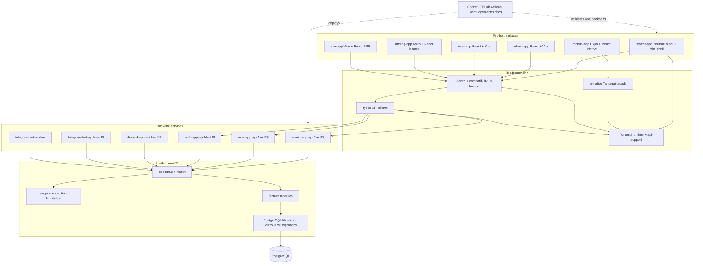

# Nest React Boilerplate

A production-oriented Nx monorepo starter for teams building React frontends, Expo mobile apps, and NestJS services on PostgreSQL. It packages Vite SPAs, an Astro landing app, a Vike SSR site, an Expo/React Native mobile app, NestJS API and worker services, shared platform libraries, OpenAPI-driven clients, database migrations, Docker Compose stacks, and GitHub Actions quality gates.

## System at a glance


```mermaid
flowchart TB
  subgraph Product["Product surfaces"]
    Starter["starter-app neutral React + Vite shell"]
    Admin["admin-app React + Vite"]
    User["user-app React + Vite"]
    Landing["landing-app Astro + React islands"]
    Site["site-app Vike + React SSR"]
    Mobile["mobile-app Expo + React Native"]
  end
  subgraph Frontend["libs/frontend/**"]
    UI["ui-web + compatibility UI facade"]
    NativeUI["ui-native Tamagui facade"]
    Runtime["frontend runtime + api-support"]
    Client["typed API clients"]
  end
  subgraph Services["Backend services"]
    AdminApi["admin-app-api NestJS"]
    UserApi["user-app-api NestJS"]
    AuthApi["auth-app-api NestJS"]
    DiscordApi["discord-app-api NestJS"]
    TelegramApi["telegram-bot-api NestJS"]
    TelegramWorker["telegram-bot-worker"]
  end
  subgraph Backend["libs/backend/**"]
    Bootstrap["bootstrap + health"]
    Exception["singular exception foundation"]
    Features["feature modules"]
    Postgres["PostgreSQL libraries + MikroORM migrations"]
  end
  Data[(PostgreSQL)]
  Ops["Docker, GitHub Actions, Helm, operations docs"]

  Starter --> UI
  Starter --> Runtime
  Admin --> UI
  User --> UI
  Landing --> UI
  Site --> UI
  Mobile --> NativeUI
  NativeUI --> Runtime
  UI --> Runtime
  UI --> Client
  Client --> Runtime
  Client --> AdminApi
  Client --> UserApi
  Client --> AuthApi
  AdminApi --> Bootstrap
  UserApi --> Bootstrap
  AuthApi --> Bootstrap
  DiscordApi --> Bootstrap
  TelegramApi --> Bootstrap
  TelegramWorker --> Bootstrap
  Bootstrap --> Exception
  Bootstrap --> Features
  Features --> Postgres
  Postgres --> Data
  Ops -. "validates and packages" .-> Product
  Ops -. "deploys" .-> Services
```

Start here when evaluating the repo, then use the linked deep dives for architecture, API lifecycle, local verification, and operations.

## Quick links

| Topic                 | Doc                                                                                                                          |
| --------------------- | ---------------------------------------------------------------------------------------------------------------------------- |
| Getting started       | [Quick Start](docs/quick-start.md)                                                                                           |
| Command reference     | [Command Matrix](docs/command-matrix.md)                                                                                     |
| System architecture   | [Architecture](docs/architecture.md) · [Deep dives](docs/architecture/README.md)                                             |
| Environment config    | [Environment Variables](docs/environment-variables.md)                                                                       |
| Monitoring & alerting | [Monitoring](docs/monitoring.md)                                                                                             |
| Supply chain & SLSA   | [Supply Chain Security](docs/supply-chain.md)                                                                                |
| API contracts         | [API Contracts](docs/api-contracts.md) · [Lifecycle](docs/api-lifecycle-policy.md)                                           |
| Database              | [Migrations](docs/database-migrations.md)                                                                                    |
| Deployment            | [Production Deploy](docs/production-deploy.md) · [Helm](.helm/README.md) · [Multi-platform CI](docs/deployment-platforms.md) |
| Testing               | [Testing](docs/testing.md)                                                                                                   |
| Operations            | [Runbooks](docs/runbooks/README.md)                                                                                          |
| ADRs                  | [Architecture Decision Records](docs/adr/README.md)                                                                          |

## Integrations

| Integration     | Status           | Notes                                                                                   |
| --------------- | ---------------- | --------------------------------------------------------------------------------------- |
| PostgreSQL      | ✅ Wired         | Primary database via MikroORM; migrations committed                                     |
| Redis           | ✅ Wired         | Session storage, rate-limit backend (configurable: `single`/`sentinel`/`cluster`)       |
| NATS            | ✅ Wired         | Async messaging backbone for bot workers and event-driven features                      |
| Telegram Bot    | ✅ Wired         | Webhook + polling modes, Mini App / Open App support, social auth                       |
| Discord Bot     | ✅ Wired         | Slash commands, interactions endpoint, OAuth 2.0 social auth                            |
| S3 / MinIO      | ✅ Wired         | Object storage; uses `@aws-sdk/client-s3`, MinIO in local Compose                       |
| SendGrid        | 📋 Contract-only | Email service SDK wired; requires `SENDGRID_API_KEY` to activate                        |
| PostHog         | 📋 Contract-only | Analytics client configured; requires `POSTHOG_API_KEY` to activate                     |
| OpenTelemetry   | ✅ Wired         | OTLP exporter for traces, metrics, logs; disabled by default (`OTEL_ENABLED=false`)     |
| Prometheus      | ✅ Wired         | Each backend exposes `/metrics`; see [Monitoring](docs/monitoring.md) for scrape config |
| OAuth (generic) | 📋 Contract-only | Better Auth social provider slot; disabled until provider code is added                 |

**Wired** = runtime code exists and is exercised by tests. **Contract-only** = env vars and config slots exist; activate by providing credentials and flipping the feature flag.

## Tech stack

| Area           | Choices                                                                                      |
| -------------- | -------------------------------------------------------------------------------------------- |
| Workspace      | Nx, pnpm `11.11.0`, Node.js `>=24 <25`, TypeScript                                           |
| Frontend       | React, Vite SPAs, Astro, Vike SSR, Expo/React Native, Tamagui, shared UI, Storybook          |
| Backend        | NestJS on Fastify, CLS request context, Helmet, validation pipes, health/readiness endpoints |
| Error handling | RFC 9457 (`application/problem+json`), static exception definitions, zero message leakage    |
| Persistence    | PostgreSQL, MikroORM, explicit migrations, `neverthrow` repository results                   |
| API contracts  | Nest Swagger/OpenAPI JSON, `openapi-typescript`, `openapi-fetch`, typed React Query helpers  |
| Quality        | ESLint, Prettier, Vitest, Playwright, Storybook tests, repo tooling checks, GitHub Actions   |
| Delivery       | Docker Compose, Dockerfiles, Kubernetes/Helm guidance, production runbooks                   |

## Repository map

| Path                                          | Purpose                                                                     |
| --------------------------------------------- | --------------------------------------------------------------------------- |
| `apps/frontend/starter-app`                   | Neutral Vite product shell used by the starter preset.                      |
| `apps/frontend/admin`                         | Admin React app shell.                                                      |
| `apps/frontend/app`                           | User-facing React app shell.                                                |
| `apps/frontend/landing`                       | Public Astro landing app with React islands.                                |
| `apps/frontend/site`                          | Vike SSR product/user site.                                                 |
| `apps/frontend/mobile`                        | Expo/React Native mobile app.                                               |
| `apps/e2e/fullstack`                          | Full-stack Playwright/e2e verification project.                             |
| `apps/backend/admin/admin-app-api`            | Admin NestJS API.                                                           |
| `apps/backend/user/user-app-api`              | User NestJS API.                                                            |
| `apps/backend/auth/auth-app-api`              | Auth NestJS API.                                                            |
| `apps/backend/discord/discord-app-api`        | Discord interaction/OAuth integration API.                                  |
| `apps/backend/telegram/telegram-bot-api`      | Telegram bot webhook/API surface.                                           |
| `apps/backend/telegram/telegram-bot-worker`   | Telegram bot worker process.                                                |
| `apps/backend/*/*-app-api/contracts/openapi`  | Committed OpenAPI producer output for review and generation.                |
| `libs/frontend/ui-web`                        | Shared React DOM UI primitives.                                             |
| `libs/frontend/ui-native`                     | Shared Tamagui/native UI facade for Expo/React Native.                      |
| `libs/frontend/ui`                            | Compatibility facade and Storybook configuration.                           |
| `libs/frontend/runtime`                       | Non-visual frontend runtime for i18n, query, shell state, and theme.        |
| `libs/frontend/api-support`                   | Browser-safe API environment, request, and error plumbing.                  |
| `libs/frontend/api-client`                    | Generated frontend clients plus typed service wrappers.                     |
| `libs/backend/common`                         | Backend bootstrap, health, exception, validation, and response foundations. |
| `libs/backend/feature/<scope>/<layer>/lib`    | Backend feature modules, bot libraries, and feature-owned persistence.      |
| `libs/backend/postgres/main/shared/lib`       | Shared PostgreSQL configuration and MikroORM infrastructure.                |
| `libs/common/api-contracts/lib/src/generated` | Shared generated contract review types.                                     |
| `libs/**/lib`                                 | Nx library project roots, each with local README and AGENTS files.          |
| `packages/tooling`                            | Repository automation used by local checks and CI.                          |
| `docs/architecture`                           | Focused architecture deep dives and boundary docs.                          |
| `docs/adr`                                    | Architecture decision records and template.                                 |
| `docs/runbooks`                               | Operational runbook index and templates.                                    |
| `docs/ai`                                     | Agent policy, retrieval, context packing, and workflow docs.                |
| `docs`                                        | Architecture, API, testing, operations, deployment, and workflow guides.    |

## Quickstart

For a complete setup guide, see [Quick Start](docs/quick-start.md).

```bash
nvm use
corepack enable
corepack prepare pnpm@11.11.0 --activate
pnpm install --frozen-lockfile
cp .env.example .env
pnpm run dev:db
pnpm run db:migrate
pnpm run dev
```

Default local services:

- Neutral start: before setup, `pnpm run dev` (or `pnpm run dev:fullstack`) starts `starter-app`, `user-app-api`, and `auth-app-api`. `starter-app` uses Vite on port `4204` and intentionally contains no reference-product page composition. Use `pnpm run dev:all` only when you intentionally need every serve target.
- Reference frontends: `admin-app` and `user-app` use Vite, `landing-app` uses Astro, `site-app` uses Vike, and `mobile-app` uses Expo/React Native. Local ports are `4200` admin, `4201` user, `4202` landing, `4203` site, and `4300` mobile. Select them explicitly through setup when their example flows are useful.
- APIs: `admin-app-api`, `user-app-api`, and `auth-app-api` expose `/health`, `/health/private`, `/live`, and `/ready`.
- OpenAPI: set `OPENAPI_ENABLED=true` locally and use each API's `OPENAPI_PATH`.

For configuration (interactive/noninteractive), setup health checks, and adding apps/libraries/features, see the [Documentation Index](docs/README.md).

## Quality gates

Run the fast local gate before opening a PR:

```bash
pnpm run check:fast
```

Use targeted gates for the surface you changed:

| Change area                   | Commands                                                                                     |
| ----------------------------- | -------------------------------------------------------------------------------------------- |
| Tooling or repository scripts | `pnpm run tooling:static-check`                                                              |
| Formatting-only/docs          | `pnpm run format:changed`, Markdown link check for touched files, `git diff --check`         |
| Frontend boundaries           | `pnpm run frontend:fsd:check` plus relevant app tests/builds                                 |
| API shape                     | `pnpm run api:contracts:check`, `pnpm run api:clients:check`, `pnpm run api:openapi:lint`    |
| Database migrations           | `pnpm run db:migrations:check`; add rollback checks when Docker/Testcontainers are available |
| Runtime TypeScript            | `pnpm run lint`, `pnpm run typecheck`, focused `pnpm run test`/Nx project tests              |
| Release-risk or cross-cutting | `pnpm run check`                                                                             |

CI is extra evidence; local validation remains required for code changes.

## Documentation index

- [Architecture](docs/architecture.md) and [architecture deep dives](docs/architecture/README.md) — app/library split, runtime boundaries, data flow, naming, and DDD boundaries.
- [Architecture decision records](docs/adr/README.md) — durable architecture decisions and ADR template.
- [Runbooks](docs/runbooks/README.md) — operational runbook index and service incident template.
- [AI agent policy](docs/ai/agent-policy.md), [repo map](docs/ai/repo-map.md), [retrieval policy](docs/ai/retrieval-policy.md), [context packing](docs/ai/context-packing.md), and [agent workflows](docs/ai/agent-workflows.md) — how repository context is organized for coding agents.
- Every Nx app, library, and package project root has a local `README.md` and `AGENTS.md`; use those files for nearest ownership and command notes before editing that project.
- [Technology choices](docs/technology-choices.md) — framework and platform decisions.
- [Command matrix](docs/command-matrix.md) — supported local and CI commands.
- [Local verification](docs/local-verification.md) — reproducible workstation checks.
- [Testing](docs/testing.md) and [Modern QA](docs/testing/modern-qa.md) — unit, component, e2e, Storybook, and coverage strategy.
- [API contracts](docs/api-contracts.md), [API conventions](docs/api-conventions.md), and [API lifecycle policy](docs/api-lifecycle-policy.md) — OpenAPI generation, error responses, health, and compatibility rules.
- [Database migrations](docs/database-migrations.md) — MikroORM standards and review checklist.
- [Operations](docs/operations.md), [Production deploy](docs/production-deploy.md), [Deployment](docs/deployment.md), and [Production readiness](docs/production-readiness.md) — release, runtime, and runbook guidance.
- [Dependency management](docs/dependency-management.md) and [Branch protection](docs/branch-protection.md) — supply-chain and repository governance.

## Contributor and agent policy

- Human and AI contributors must follow [CONTRIBUTING.md](CONTRIBUTING.md).
- AI coding agents must follow [AGENTS.md](AGENTS.md) and the detailed [AI agent policy](docs/ai/agent-policy.md); deeper context lives under [docs/ai](docs/ai/repo-map.md), and tool-specific instruction files only redirect to the canonical policy.
- Author-sensitive work must use raw git with the configured author/committer, not GitHub web merge/squash flows.
- Never expose secrets, commit real environment values, or add generated artifacts unless the task explicitly includes regeneration.

## Security baseline

Security defaults are intentionally conservative: production CORS has no wildcard, admin bootstrap is disabled unless explicitly enabled, OpenAPI is disabled in production examples, production frontend builds require explicit API origins or `VITE_API_BASE_URL_MODE=same-origin`, URL bearer-token bootstrap is ignored outside development/test modes, and OAuth is disabled until provider-specific product code is configured.

See [SECURITY.md](SECURITY.md) for reporting expectations and baseline controls.
