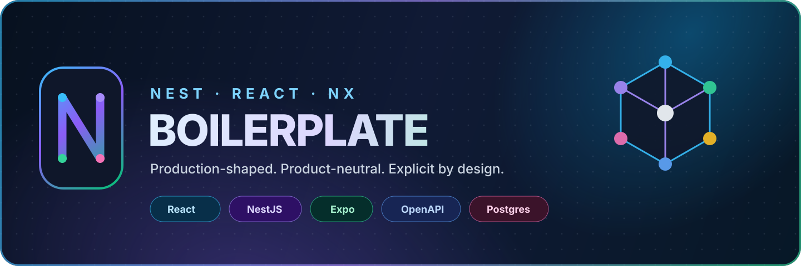
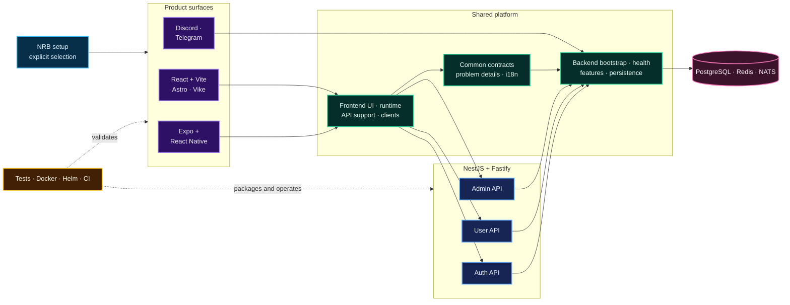

<a id="readme-top"></a>

<div align="center">
  

  <h1>Nest React Boilerplate</h1>

  <p>
    <strong>A production-shaped Nx foundation for web, mobile, APIs, workers, and integrations.</strong>
    <br />
    Select only the product surfaces you need, keep runtime ownership explicit, and ship through one typed platform.
  </p>

  <p>
    <a href="https://github.com/nmime/nest-react-boilerplate/actions/workflows/ci.yml"></a>
    <a href="https://github.com/nmime/nest-react-boilerplate/releases"></a>
    
    
    
    
    <a href="LICENSE"></a>
  </p>

  <p>
    <a href="#quick-start">Quick start</a> ·
    <a href="#choose-your-product-surfaces">Applications</a> ·
    <a href="#architecture">Architecture</a> ·
    <a href="#quality-by-default">Quality</a> ·
    <a href="#documentation">Documentation</a>
  </p>
</div>

## Why this foundation

This repository is more than a framework starter. It is an executable platform contract for teams that want frontend, backend, mobile, API, data, testing, and delivery decisions to agree from the first commit.

|                                                                                                                                         |                                                                                                                                        |
| --------------------------------------------------------------------------------------------------------------------------------------- | -------------------------------------------------------------------------------------------------------------------------------------- |
| **🧩 Explicit product selection**<br />Choose applications with `pnpm nrb setup`; the repo never invents a default deployable.          | **⚡ Multi-renderer frontend**<br />React + Vite SPAs, Astro islands, Vike SSR, Expo/React Native, Tamagui, and Storybook.             |
| **🛡️ Production NestJS backend**<br />Fastify, PostgreSQL + MikroORM, Redis, NATS, request CLS, health probes, and graceful operations. | **📜 Contract-first APIs**<br />OpenAPI producers, generated TypeScript clients, typed React Query helpers, and RFC 9457 errors.       |
| **🧪 Quality as code**<br />ESLint, Prettier, Vitest, Playwright, component tests, coverage gates, contract checks, and security scans. | **🚀 Multiple delivery paths**<br />Docker Compose, multi-stage images, Kubernetes/Helm, GitHub Actions, and single-server operations. |

### Design principles

- **Product-neutral reference UI** — useful application shells without fake business data or a demo brand.
- **Ownership before convenience** — every deployable, feature, library, route, contract, and migration has an explicit home.
- **Generated contracts stay reviewable** — controllers and DTOs own API truth; committed outputs make drift visible.
- **Secure defaults** — conservative CORS, disabled production OpenAPI, explicit API origins, secret scanning, and no accidental bootstrap paths.
- **Local proof first** — CI is additional evidence, not a substitute for focused local verification.

## Choose your product surfaces

There is no default application. Setup records an explicit selection in `.nrb/workspace.json`, and you can rerun it whenever the product grows.

| Surface              | Included choices                                                                 |
| -------------------- | -------------------------------------------------------------------------------- |
| **Web applications** | Admin and user React + Vite SPAs, an Astro landing app, and a Vike SSR site      |
| **Mobile**           | Expo + React Native with shared native UI and authentication dependencies        |
| **Core APIs**        | Separate NestJS + Fastify services for admin, user, and authentication ownership |
| **Integrations**     | Optional Discord interaction API and Telegram bot API                            |
| **End to end**       | A Playwright full-stack project tied to the selected core applications           |

Use the generated [Project Catalog](docs/project-catalog.md) for stable application IDs, Nx roots, selection dependencies, runtimes, and template hostnames.

```bash
# Interactive product selection
pnpm nrb setup

# Add one application explicitly later
pnpm nrb setup --app landing-app

# Inspect the live Nx graph
pnpm exec nx show projects
```

## Quick start

### Prerequisites

| Requirement | Supported version or role                     |
| ----------- | --------------------------------------------- |
| Node.js     | `>=24 <25` — pinned by `.nvmrc`               |
| pnpm        | `11.11.0` through Corepack                    |
| Docker      | Local PostgreSQL and broader Compose profiles |
| Bun         | `1.3.14` — supported alternative runtime      |

### Start the selected stack

```bash
nvm use
corepack enable
corepack prepare pnpm@11.11.0 --activate
pnpm install --frozen-lockfile

pnpm nrb setup
cp .env.example .env

pnpm run dev:db
pnpm run db:migrate
pnpm run dev
```

`pnpm run dev` starts only the applications recorded by setup. It refuses to silently fall back to every application. Use `pnpm run dev:all` only when you intentionally want every serve target.

For noninteractive setup, capability selection, app additions, and troubleshooting, continue with the [Quick Start](docs/quick-start.md) and [Setup and Configuration](docs/setup/configuration.md).

## Architecture


```mermaid
flowchart LR
  Setup["NRB setup<br/>explicit selection"] --> Products

  subgraph Products["Product surfaces"]
    Web["React + Vite<br/>Astro · Vike"]
    Mobile["Expo +<br/>React Native"]
    Integrations["Discord ·<br/>Telegram"]
  end

  subgraph Platform["Shared platform"]
    Frontend["Frontend UI · runtime<br/>API support · clients"]
    Common["Common contracts<br/>problem details · i18n"]
    Backend["Backend bootstrap · health<br/>features · persistence"]
  end

  subgraph Services["NestJS + Fastify"]
    Admin["Admin API"]
    User["User API"]
    Auth["Auth API"]
  end

  Data[("PostgreSQL · Redis · NATS")]
  Delivery["Tests · Docker · Helm · CI"]

  Web --> Frontend
  Mobile --> Frontend
  Integrations --> Backend
  Frontend --> Common
  Frontend --> Admin
  Frontend --> User
  Frontend --> Auth
  Common --> Backend
  Admin --> Backend
  User --> Backend
  Auth --> Backend
  Backend --> Data
  Delivery -. "validates" .-> Products
  Delivery -. "packages and operates" .-> Services

  classDef setup fill:#082f49,stroke:#38bdf8,color:#e0f2fe,stroke-width:2px;
  classDef product fill:#2e1065,stroke:#a78bfa,color:#f5f3ff,stroke-width:2px;
  classDef platform fill:#052e2b,stroke:#34d399,color:#ecfdf5,stroke-width:2px;
  classDef service fill:#172554,stroke:#60a5fa,color:#eff6ff,stroke-width:2px;
  classDef data fill:#3b132a,stroke:#f472b6,color:#fdf2f8,stroke-width:2px;
  classDef delivery fill:#422006,stroke:#fbbf24,color:#fffbeb,stroke-width:2px;

  class Setup setup;
  class Web,Mobile,Integrations product;
  class Frontend,Common,Backend platform;
  class Admin,User,Auth service;
  class Data data;
  class Delivery delivery;
```

### Platform stack

| Layer            | Technology and responsibility                                                                        |
| ---------------- | ---------------------------------------------------------------------------------------------------- |
| 🟦 **Workspace** | Nx 23, TypeScript, pnpm 11.11.0, Node.js 24, and Bun 1.3.14 runtime support                          |
| 🟪 **Frontend**  | React, Vite, Astro, Vike, Expo, React Native, Tamagui, TanStack Query, MobX shell state              |
| 🟩 **Backend**   | NestJS on Fastify, request context through `AsyncLocalStorage`, validation, Helmet, health/readiness |
| 🩷 **Data**      | PostgreSQL, MikroORM, explicit migrations, Redis, NATS, S3/MinIO adapters                            |
| 🟨 **Contracts** | OpenAPI, generated clients, RFC 9457 Problem Details, typed public extensions                        |
| 🟧 **Delivery**  | Docker Compose, Dockerfiles, Kubernetes/Helm, GitHub Actions, release and operations runbooks        |

Explore the full boundary model in [Architecture](docs/architecture.md) and the focused [Architecture Deep Dives](docs/architecture/README.md).

## Integrations

| Integration    | Status             | What is included                                                                       |
| -------------- | ------------------ | -------------------------------------------------------------------------------------- |
| PostgreSQL     | 🟢 Wired           | MikroORM configuration, feature-owned entities, and committed migrations               |
| Redis          | 🟢 Wired           | Session and rate-limit infrastructure with single, sentinel, and cluster modes         |
| NATS           | 🟢 Wired           | Messaging backbone for workers and event-driven features                               |
| Telegram       | 🟢 Wired           | Better Auth OIDC, signed TMA sessions, webhook/polling bot runtime, and Open App menus |
| Discord        | 🟢 Wired           | Slash commands, interactions endpoint, and OAuth 2.0 social authentication             |
| S3 / MinIO     | 🟢 Wired           | AWS SDK v3 adapter, injectable test adapter, and local MinIO profile                   |
| PostHog        | 🟢 Wired           | Disabled-by-default analytics provider with an explicit API-key contract               |
| OpenTelemetry  | 🟢 Wired on Node   | OTLP traces and metrics with a Prometheus-exporting collector path                     |
| Email provider | 🟡 Extension point | Better Auth lifecycle ownership is ready; the product chooses its vendor               |

**Wired** means runtime code exists and is exercised by tests. **Extension point** means the repository provides ownership without pretending a vendor integration is bundled.

## Quality by default

The repository treats formatting, architecture boundaries, generated contracts, migrations, coverage, security, and deployment configuration as executable checks.

```bash
# Fast local aggregate for normal changes
pnpm run check:fast

# Full non-runtime aggregate for cross-cutting changes
pnpm run check
```

| Change area             | Focused proof                                                                               |
| ----------------------- | ------------------------------------------------------------------------------------------- |
| Documentation           | `pnpm run docs:check` · `pnpm run format:changed` · `git diff --check`                      |
| Repository tooling      | `pnpm run tooling:static-check`                                                             |
| Frontend boundaries     | `pnpm run frontend:fsd:check` plus owning app tests/builds                                  |
| API contracts           | `pnpm run api:contracts:check` · `pnpm run api:clients:check` · `pnpm run api:openapi:lint` |
| Database changes        | `pnpm run db:migrations:check` plus rollback proof when Docker is available                 |
| Runtime code            | `pnpm run lint` · `pnpm run typecheck` · focused Nx/Vitest tests                            |
| Security-sensitive work | `pnpm run test:security:secrets` plus targeted SAST/security checks                         |

Testing spans unit and integration suites, Storybook interaction and visual checks, Playwright browser flows, Testcontainers-backed component tests, OpenAPI consumer/fuzz checks, property tests, and coverage thresholds. See [Testing](docs/testing.md), [Modern QA](docs/testing/modern-qa.md), and [Local Verification](docs/local-verification.md).

## Repository layout

```text
apps/
├── frontend/                 # Vite, Astro, Vike, and Expo deployables
├── backend/<scope>/          # NestJS APIs, bots, workers, and schedulers
└── e2e/                      # Cross-application Playwright projects

libs/
├── frontend/                 # UI, runtime, API support, clients, and frontend features
├── backend/                  # Bootstrap, health, features, and PostgreSQL infrastructure
└── common/                   # Cross-runtime contracts, i18n, notifications, and problem details

packages/tooling/             # NRB setup, generators, checks, and repository automation
docs/                         # Architecture, workflows, testing, deployment, and runbooks
deploy/                       # Single-server lifecycle automation
docker/                       # Production Compose topology and supporting configuration
.helm/                        # Kubernetes chart and deployment values
```

Public TypeScript aliases in `tsconfig.base.json` are stable API. Every project root carries its nearest `README.md` and `AGENTS.md`; use those before changing project-owned behavior.

## Delivery paths

| Target                      | Start here                                                                                              |
| --------------------------- | ------------------------------------------------------------------------------------------------------- |
| Local dependencies          | [Quick Start](docs/quick-start.md) and the root Docker Compose stack                                    |
| Production Compose          | [Docker Compose Production](docs/docker-compose-production.md)                                          |
| Kubernetes / Helm           | [Production Deploy](docs/production-deploy.md) and [.helm/README.md](.helm/README.md)                   |
| Single Ubuntu/Debian server | [Idempotent Single-Server Deployment](docs/single-server-deployment.md)                                 |
| Release and hardening       | [Release Hardening](docs/release-hardening.md) and [Production Readiness](docs/production-readiness.md) |
| Operations                  | [Operations Guide](docs/operations.md) and [Runbooks](docs/runbooks/README.md)                          |

## Documentation

| Goal                          | Canonical guide                                                                                                    |
| ----------------------------- | ------------------------------------------------------------------------------------------------------------------ |
| Understand every application  | [Project Catalog](docs/project-catalog.md)                                                                         |
| Configure or extend setup     | [Setup and Configuration](docs/setup/configuration.md) · [Scaffolding Contract](docs/scaffolding-and-extension.md) |
| Find a supported command      | [Command Matrix](docs/command-matrix.md)                                                                           |
| Understand system boundaries  | [Architecture](docs/architecture.md) · [Deep Dives](docs/architecture/README.md)                                   |
| Work with APIs and clients    | [API Contracts](docs/api-contracts.md) · [API Lifecycle](docs/api-lifecycle-policy.md)                             |
| Add or review migrations      | [Database Migrations](docs/database-migrations.md)                                                                 |
| Configure environment values  | [Environment Variables](docs/environment-variables.md)                                                             |
| Verify the repository locally | [Local Verification](docs/local-verification.md)                                                                   |
| Browse everything             | [Documentation Index](docs/README.md)                                                                              |

## Security and contribution

Production examples avoid wildcard CORS, disable admin bootstrap and OpenAPI unless explicitly enabled, require deliberate frontend API origins, ignore URL bearer-token bootstrap outside development/test, and keep OAuth providers disabled until the owning product configures them.

- Report security issues and review the baseline in [SECURITY.md](SECURITY.md).
- Read [CONTRIBUTING.md](CONTRIBUTING.md) before opening a change.
- AI contributors must follow [AGENTS.md](AGENTS.md) and the canonical [AI Agent Policy](docs/ai/agent-policy.md).
- Never commit real environment values, credentials, secret material, local volumes, or generated output without its owning source change.

## License

Released under the [MIT License](LICENSE). Built and maintained by [nmime](https://github.com/nmime).

<div align="right">
  <a href="#readme-top">Back to top ↑</a>
</div>
