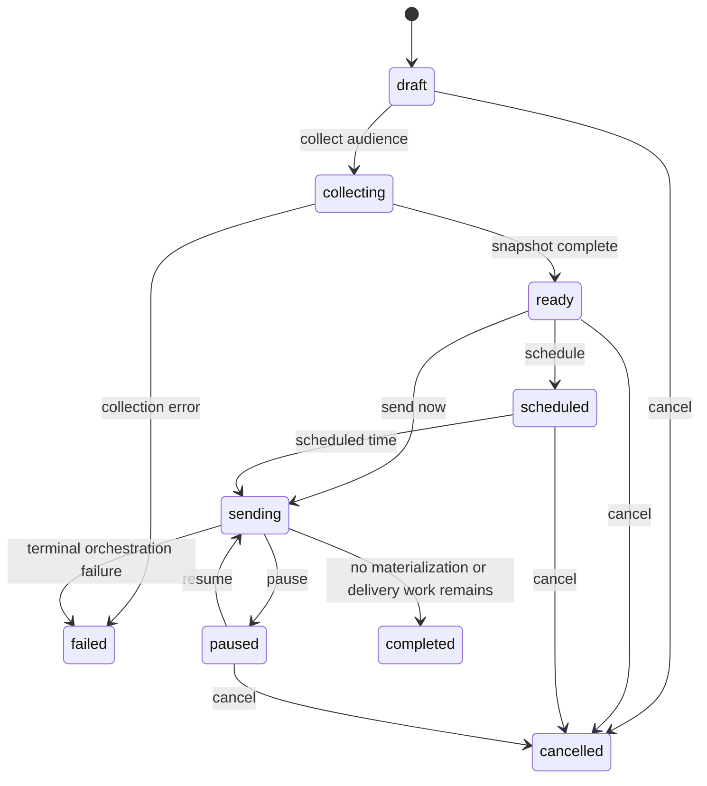
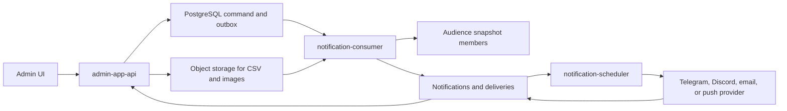

# Admin notification broadcasts: product and technical specification

Status: implemented platform baseline plus target production specification  
Last reviewed: 2026-07-21  
Implementation owner: notification domain, admin API, and admin frontend  
Reference work: PM-93, DEV-1189, DEV-1190, DEV-1192, and DEV-3194

The Jira epic and all four linked tasks were verified in Jira on 2026-07-21.
PM-93 is a To Do epic; DEV-1189, DEV-1190, DEV-1192, and DEV-3194 are Backlog
tasks. This document normalizes their requirements without changing their Jira
state.

## Decision summary

The admin panel will expose three separate resources:

1. notification templates and immutable published versions;
2. audience segments and materialized audience snapshots;
3. broadcast requests that bind one published template version to one audience
   snapshot and one explicit delivery route.

Broadcast creation, audience collection, and delivery are separate operations.
The admin API never loops over recipients or calls Telegram directly. A
`notification-consumer` materializes large audiences and notification rows in
idempotent chunks. The existing `notification-scheduler` remains the only owner
that claims and sends delivery rows.

The initial audience-combination rule is an OR union of selected segments. A
recipient appearing in multiple segments is included once. Arbitrary SQL, an
admin-authored query language, implicit provider fallback, and synchronous mass
sending are explicitly out of scope.

## Implemented baseline and remaining production work

The repository implements the provider/version/segment/snapshot/broadcast data
model, auth-users resolver, S3-backed asynchronous CSV validation, consumer and
scheduler runtimes, admin RBAC/API/client contracts, and the three admin pages.
It also implements Telegram, Discord, Resend, MailPace, FCM, and APNs provider
strategies.

The stricter requirements later in this specification remain the production
hardening plan where they require installation infrastructure: product-specific
reference-product category resolvers, multipart streaming upload, malware scanning, safe
downloadable error artifacts and object-retention policy, transactional outbox
publication for notification audit events, provider dashboards/alerts, and
million-recipient load and failover drills. The current API accepts a size-bounded base64 JSON CSV payload,
stores it in S3, and processes it asynchronously; it does not claim multipart
streaming.

## Why the reference implementation is not a schema to copy

The reference Telegram flow provides useful transport behavior:

- localized body, image, and inline keyboard content;
- `string-format` and Eta template rendering;
- Telegram HTML messages and photo captions;
- URL, callback, web-app, switch-inline, and custom-emoji buttons;
- silent messages and link-preview controls;
- user, direct Telegram chat, and system Telegram chat targets;
- Telegram-specific permanent and retryable error classification.

The boilerplate already has channel-specific template rows, immutable
notification events, separate delivery rows, explicit providers, encrypted
sensitive data, leased queue claims, and provider-neutral delivery. Those are
stronger boundaries than the reference's legacy single-table notification queue and
must be preserved.

Admin-authored templates must not expose Eta. Eta permits executable template
expressions and is suitable only for reviewed code-owned templates. Admin
templates use the safe placeholder engine, an explicit variable schema, and
Telegram-HTML validation.

## Jira requirements normalized

### DEV-1189: segment constructor

- Segments are saved audience definitions evaluated immediately before a
  broadcast is sent.
- Selecting multiple segments produces a distinct recipient union.
- Static segments support CSV upload, validation, and import status.
- Dynamic segments are implemented by registered resolvers.
- Audience snapshots preserve the exact recipients used by a broadcast.

The referenced product task lists fifteen product-specific categories across deposits,
exchange trading, balances, P2P deals, cheques, registration, and inactivity.
This boilerplate does not own those product tables. It therefore ships the
resolver contract and static CSV segment, while product installations register
only the dynamic categories for which they own authoritative read models.

The installation-level resolver catalog required by DEV-1189 is:

| #   | Proposed resolver key         | Ticket rule                                                                      |
| --- | ----------------------------- | -------------------------------------------------------------------------------- |
| 1   | `deposit-volume-60d-1-10`     | Deposited USD 1 through 10 during the previous 60 days                           |
| 2   | `deposit-volume-60d-10-100`   | Deposited USD 10 through 100 during the previous 60 days                         |
| 3   | `deposit-volume-60d-over-100` | Deposited more than USD 100 during the previous 60 days                          |
| 4   | `exchange-traders-60d`        | At least one exchange trade during the previous 60 days                          |
| 5   | `exchange-turnover-60d-100`   | Exchange turnover of at least USD 100 during the previous 60 days                |
| 6   | `active-balance-60d-1-10`     | Current active balance of USD 1 through 10, active within 60 days                |
| 7   | `active-balance-60d-10-100`   | Current active balance of USD 10 through 100, active within 60 days              |
| 8   | `active-balance-60d-over-100` | Current active balance above USD 100, active within 60 days                      |
| 9   | `p2p-participants-60d`        | Maker or taker in at least one P2P deal during the previous 60 days              |
| 10  | `p2p-turnover-60d-100`        | Maker or taker with P2P turnover of at least USD 100 during the previous 60 days |
| 11  | `cheque-creators-60d`         | Created a cheque during the previous 60 days                                     |
| 12  | `cheque-activators-60d`       | Activated a cheque during the previous 60 days                                   |
| 13  | `bot-registrations-60d`       | Registered in the bot during the previous 60 days                                |
| 14  | `bot-inactive-0-90d`          | Last bot activity was between now and 90 days ago                                |
| 15  | `bot-inactive-over-90d`       | Last bot activity was more than 90 days ago                                      |

Each resolver must use a single `snapshotAt`, return canonical user targets,
apply the installation's authoritative USD-conversion and activity rules, and
deduplicate before persistence. The ticket's amount bands overlap at exactly
USD 10; the installation contract should normalize them to half-open bands
`[1, 10)`, `[10, 100]`, and `(100, +infinity)` unless product explicitly chooses
different boundaries. The boilerplate must not guess those product semantics.

### DEV-1190: notification constructor

- Admins can create localized RU/EN content.
- Telegram content supports formatted text, an image, and buttons with links.
- The admin panel lists templates and can create new admin templates.
- Code-owned templates are visible but read-only.

### DEV-1192: sender

- The system resolves a selected audience and sends the prepared content.
- A broadcast can be paused and resumed.
- Notifications and deliveries retain the broadcast identifier.
- Priority is selectable from 0 through 10 and defaults to 0.

### DEV-3194: complete admin workflow

- A notification definition contains a template per selected channel.
- Every template has server-rendered preview and test-send actions.
- Test send requires explicit sample values for unresolved variables.
- CSV audience uploads expose validation status and row counts.
- CSV columns may provide per-recipient template variables.
- Templates, segments, and broadcast requests remain separate admin resources.

## Existing repository capabilities

The implementation extends these owners instead of creating a parallel system:

| Owner                                      | Existing responsibility                        | Required extension                                                    |
| ------------------------------------------ | ---------------------------------------------- | --------------------------------------------------------------------- |
| `@app/common-notifications`                | Provider-neutral contracts                     | Broadcast, segment, source, version, and state contracts              |
| `@app/backend-feature-notification-shared` | Notification service and persistence ports     | Admin use-case ports, resolver registry, preview contract             |
| `@app/backend-feature-notification-main`   | Rendering, providers, HTTP opt-in, scheduler   | Safe rendering and broadcast-aware claiming                           |
| `@app/backend-feature-notification-admin`  | Privileged notification HTTP and orchestration | Templates, segments, broadcasts, RBAC, audit integration              |
| `@app/backend-feature-audit-log-admin`     | Tenant-scoped audit inspection and writer      | Filtered list/detail/meta endpoints and notification audit recording  |
| `@app/backend-postgres-main-notification`  | PostgreSQL queue and templates                 | Versioned templates, segments, snapshots, broadcasts, materialization |
| `admin-app-api`                            | Authenticated admin HTTP composition           | Compose domain admin modules without owning their controllers         |
| `apps/frontend/admin`                      | Admin FSD product UI                           | Template, segment, and broadcast pages                                |
| `notification-scheduler`                   | Scheduled claiming and provider delivery       | Scheduled activation and paused-broadcast filtering                   |
| `notification-consumer`                    | New consumer composition root                  | CSV validation, snapshot collection, chunk materialization            |

`notification-consumer` is a consumer, not a generic worker type. It must be
generated with the repository's `consumer` renderer and remain a thin
composition root.

## User roles and authorization

Add the following permission keys to the shared authorization catalog:

| Permission                               | Allows                                                     |
| ---------------------------------------- | ---------------------------------------------------------- |
| `admin:notification-templates:read`      | List, inspect, and preview templates                       |
| `admin:notification-templates:write`     | Create drafts and publish or archive admin templates       |
| `admin:notification-templates:test-send` | Send a rendered test to an explicit recipient              |
| `admin:notification-segments:read`       | List segments, resolver metadata, estimates, and snapshots |
| `admin:notification-segments:write`      | Create/update/archive segments and upload CSV audiences    |
| `admin:notification-broadcasts:read`     | List broadcasts and delivery statistics                    |
| `admin:notification-broadcasts:write`    | Create/edit drafts and collect audiences                   |
| `admin:notification-broadcasts:send`     | Schedule, start, pause, resume, or cancel a broadcast      |
| `admin:notification-broadcasts:approve`  | Approve a production broadcast when approval is required   |

`admin:manage:all` continues to imply these permissions. UI visibility is a
convenience only; every backend endpoint enforces the matching permission.

Production defaults to two-person approval. The creator cannot approve their
own broadcast. Local and test environments may disable approval with an
explicit configuration flag.

All records and queries exposed through the admin API are tenant-scoped. Global
code-owned templates can be read by tenants but never changed. Audience
resolvers must receive the tenant identifier and may not return subjects from a
different tenant.

## Domain model

### Template identity and immutable versions

`notification_templates` remains the logical identity table and gains:

| Column                      | Type             | Rule                                                         |
| --------------------------- | ---------------- | ------------------------------------------------------------ |
| `source`                    | varchar          | `code` or `admin`; immutable after creation                  |
| `tenant_id`                 | UUID nullable    | Required for admin templates; null for global code templates |
| `name`                      | varchar          | Human-readable admin label                                   |
| `status`                    | varchar          | `draft`, `published`, or `archived`                          |
| `current_version_id`        | UUID nullable    | Points to the current immutable version                      |
| `created_by` / `updated_by` | varchar nullable | Admin subject identifiers                                    |

Create `notification_template_versions`:

| Column             | Type                 | Rule                                                  |
| ------------------ | -------------------- | ----------------------------------------------------- |
| `id`               | UUID                 | Primary key                                           |
| `template_id`      | UUID                 | Foreign key to template identity                      |
| `version`          | integer              | Unique and increasing per template                    |
| `variables_schema` | JSONB                | Names, types, requirements, examples, and sensitivity |
| `published_at`     | timestamptz nullable | Null while draft                                      |
| `published_by`     | varchar nullable     | Admin subject                                         |
| timestamps         | timestamptz          | Immutable publication history                         |

Replace mutable channel ownership with
`notification_template_version_channels`. Each row contains channel, engine,
and channel content and is unique by `(template_version_id, channel)`.

Publishing creates a new immutable version. Existing notifications and
broadcasts keep their original version even after a new version is published.
Code-owned `upsertTemplate` creates a new version only when normalized content
changes. Code-owned templates are never updated through admin endpoints.

### Variable schema

Each template version declares variables explicitly:

```json
{
  "displayName": { "type": "string", "required": true, "example": "Ada", "sensitive": false },
  "actionUrl": { "type": "url", "required": true, "example": "https://example.com", "sensitive": true }
}
```

Supported v1 types are `string`, `number`, `boolean`, `url`, and `date-time`.
Unknown variables are rejected. Required variables must be provided by global
broadcast defaults or recipient-specific values. Sensitive values use the
existing notification payload encryption boundary and are never included in
logs, previews retained by audit events, or downloadable error reports.

### Segments

Create `notification_segments`:

| Column                      | Type             | Rule                              |
| --------------------------- | ---------------- | --------------------------------- |
| `id`                        | UUID             | Primary key                       |
| `tenant_id`                 | UUID             | Required scope                    |
| `name`                      | varchar          | Unique per active tenant segment  |
| `kind`                      | varchar          | `static` or `dynamic`             |
| `resolver_key`              | varchar nullable | Required for dynamic segments     |
| `parameters`                | JSONB            | Validated against resolver schema |
| `status`                    | varchar          | `active` or `archived`            |
| `created_by` / `updated_by` | varchar          | Admin subjects                    |
| timestamps                  | timestamptz      | Audit support                     |

Create `notification_segment_members` for static segments. The unique key is
`(segment_id, target_type, target_id)`. Member rows may contain normalized
language and validated variable data.

Create `notification_segment_uploads` with object-storage key, SHA-256 checksum,
status, total rows, valid rows, duplicate rows, invalid rows, bounded error
summary, and creator. CSV bytes are streamed to object storage, never stored in
PostgreSQL or loaded entirely into API memory.

### Resolver registry

Dynamic segment logic is registered through a provider-neutral port:

```ts
interface NotificationSegmentResolver {
  readonly key: string;
  readonly label: string;
  readonly parameterSchema: JsonSchema;
  estimate(input: SegmentResolveInput): Promise<SegmentEstimate>;
  resolvePage(input: SegmentResolvePageInput): Promise<SegmentResolvePage>;
}
```

Resolvers must:

- use owned repositories or read models, never raw SQL accepted from the admin;
- apply tenant scope before all category predicates;
- use a fixed `snapshotAt` value for repeatable pagination;
- return a stable cursor and stable target ordering;
- return only canonical target identity, language, and permitted variables;
- be idempotent when a page is retried.

The reference category catalog can be implemented by product-specific resolver
packages for deposit ranges, trading activity/volume, active balance ranges,
P2P activity/volume, cheque creation/activation, registration, and inactivity.
It must not be hard-coded into this generic repository without those domains.

### Audience snapshots

Create `notification_audience_snapshots`:

| Column         | Type           | Rule                                              |
| -------------- | -------------- | ------------------------------------------------- |
| `id`           | UUID           | Primary key                                       |
| `broadcast_id` | UUID           | One active snapshot per broadcast revision        |
| `snapshot_at`  | timestamptz    | Shared evaluation boundary                        |
| `status`       | varchar        | `created`, `collecting`, `completed`, or `failed` |
| count columns  | bigint         | Resolved, distinct, invalid, and conflict counts  |
| `error`        | JSONB nullable | Safe bounded diagnostics                          |
| timestamps     | timestamptz    | Lifecycle                                         |

Create `notification_audience_snapshot_members` with unique
`(snapshot_id, target_type, target_id)`. Multiple selected segments are inserted
with conflict-safe deduplication. Identical duplicates count as duplicates;
conflicting per-recipient variables fail collection and must be resolved rather
than silently choosing a winner.

The selected segment rule for v1 is:

```text
audience = distinct(segment A union segment B union ... union segment N)
```

AND groups, exclusions, arbitrary nested logic, and live audiences that mutate
during sending are deferred.

### Broadcasts

Create `notification_broadcasts`:

| Column                      | Type                 | Rule                                             |
| --------------------------- | -------------------- | ------------------------------------------------ |
| `id`                        | UUID                 | Primary key and public identifier                |
| `tenant_id`                 | UUID                 | Required scope                                   |
| `name`                      | varchar              | Admin label                                      |
| `template_version_id`       | UUID                 | Immutable published version                      |
| `channel`                   | varchar              | Explicit delivery channel                        |
| `provider`                  | varchar              | Explicit concrete provider                       |
| `priority`                  | smallint             | 0 through 10, default 0                          |
| `status`                    | varchar              | Broadcast state machine                          |
| `scheduled_at`              | timestamptz nullable | Future start                                     |
| `created_by`, `approved_by` | varchar nullable     | Separation of duties                             |
| count columns               | bigint               | Snapshot, queued, sent, rejected, error, pending |
| timestamps                  | timestamptz          | Lifecycle and audit                              |

Create `notification_broadcast_segments`, unique by
`(broadcast_id, segment_id)`. A draft may change segment selection. Once audience
collection begins, changes create a new draft revision and invalidate the old
snapshot.

Add nullable `broadcast_id` and `template_version_id` to `notifications`, and
nullable `broadcast_id` to `notification_deliveries`. Add a uniqueness boundary
that prevents more than one delivery for the same broadcast, target, and
channel. This makes materialization retries safe.

Priority maps monotonically from the admin scale to delivery priority. Exact
mapping is centralized and tested; priority 10 outranks priority 0, while auth
and transactional system notifications remain above every marketing broadcast.

## State machines

### Broadcast state



Pause prevents new recipient materialization and excludes the broadcast's
pending deliveries from scheduler claims. Already claimed provider requests may
finish, so the UI documents that up to one configured delivery chunk can finish
after pause is requested. Resume does not duplicate completed recipients.

Cancel is terminal and does not retract messages already accepted by a
provider. Pending, unclaimed broadcast deliveries are marked cancelled through
a dedicated broadcast-delivery terminal state or removed only if the audit
policy explicitly permits it; they are never reported as sent.

### Upload state

`created -> validating -> completed | failed`. A completed upload can replace a
static segment atomically. A failed upload never partially changes active
membership.

## Runtime workflow



1. The admin saves and publishes a template version.
2. The admin creates a segment or uploads a static CSV.
3. The admin creates a broadcast draft, chooses segments, channel, provider,
   priority, schedule, and global variable defaults.
4. Audience collection writes an outbox command and returns immediately.
5. The consumer resolves every selected segment at one `snapshotAt`, validates
   variables, and inserts distinct snapshot members.
6. The UI reviews exact audience counts and validation/conflict counts.
7. Approval is recorded when required.
8. Send-now or scheduled activation transitions the broadcast to `sending`.
9. The consumer materializes notification and delivery rows in bounded,
   idempotent chunks.
10. The scheduler claims eligible delivery rows and invokes the concrete
    provider strategy.
11. Broadcast counters are derived from durable rows, not incremented only in
    memory.

## Telegram template rules

The admin Telegram editor exposes:

- localized RU and EN body text;
- optional localized HTTPS image URL or uploaded image asset;
- inline keyboard rows;
- URL, callback, web-app, and switch-inline button actions;
- optional custom emoji icon identifier;
- silent delivery;
- link-preview enable/disable and optional preferred preview URL;
- preview language and sample variables.

Server validation uses Telegram limits and the same payload mapper as delivery:

- HTML parse mode with a documented allowed-tag subset;
- variables escaped according to their declared type before interpolation;
- text and caption byte/character limits;
- callback data byte limit;
- HTTPS validation for URL and web-app actions;
- exactly one action per button;
- bounded keyboard rows and buttons;
- image MIME, size, and host/storage policy;
- no fallback `noop` callback for an invalid button.

Preview is server-rendered. The UI does not implement a second template engine.
Photo preview must use caption rules; text preview may show link-preview
settings. Provider tokens are never returned to the frontend.

## CSV contract

CSV is UTF-8 with a header row. Required columns are:

```text
target_id
```

Optional reserved columns are `target_type` (defaults to `user`) and `language`.
All other headers must match the selected template's variable schema or an
explicit segment-variable schema. Unknown columns are rejected.

Validation requirements:

- stream parsing with configurable file and row limits;
- formula-injection neutralization in downloadable error CSVs;
- canonical target normalization before deduplication;
- per-row length/type/URL/date validation;
- exact valid, invalid, duplicate, and conflict counts;
- a bounded UI error sample plus a full safe error artifact;
- antivirus/content scanning hook before processing;
- checksum idempotency for accidental repeat uploads;
- object expiration policy for raw and error CSV files.

The database switch from the previous completed upload to the new membership is
atomic. A partial or failed import never leaves a mixed segment.

## Admin API

All routes are versioned by the existing application versioning policy, use the
standard response envelope, and emit RFC9457 problem details on failure.

### Templates

| Method  | Route                                         | Purpose                                           |
| ------- | --------------------------------------------- | ------------------------------------------------- |
| `GET`   | `/admin/notification-templates`               | Paginated list with source/status/channel filters |
| `POST`  | `/admin/notification-templates`               | Create admin-owned draft                          |
| `GET`   | `/admin/notification-templates/:id`           | Identity, versions, and channel content           |
| `PATCH` | `/admin/notification-templates/:id`           | Edit admin draft metadata/content                 |
| `POST`  | `/admin/notification-templates/:id/publish`   | Validate and publish immutable version            |
| `POST`  | `/admin/notification-templates/:id/archive`   | Archive admin template                            |
| `POST`  | `/admin/notification-templates/:id/preview`   | Server-render sample values                       |
| `POST`  | `/admin/notification-templates/:id/test-send` | Queue one auditable real delivery                 |

Mutation routes return `409` for stale version/ETag writes. Code-owned
templates return `403` for every mutation.

### Segments

| Method  | Route                                       | Purpose                                           |
| ------- | ------------------------------------------- | ------------------------------------------------- |
| `GET`   | `/admin/notification-segments`              | List segments and last resolved counts            |
| `GET`   | `/admin/notification-segment-resolvers`     | Available category metadata and parameter schemas |
| `POST`  | `/admin/notification-segments`              | Create static or dynamic segment                  |
| `GET`   | `/admin/notification-segments/:id`          | Segment detail and upload history                 |
| `PATCH` | `/admin/notification-segments/:id`          | Update active definition                          |
| `POST`  | `/admin/notification-segments/:id/estimate` | Asynchronous or bounded estimate                  |
| `POST`  | `/admin/notification-segments/:id/uploads`  | Stream CSV upload                                 |
| `GET`   | `/admin/notification-segment-uploads/:id`   | Validation state and counts                       |
| `POST`  | `/admin/notification-segments/:id/archive`  | Archive from future selection                     |

### Broadcasts

| Method  | Route                                                 | Purpose                                          |
| ------- | ----------------------------------------------------- | ------------------------------------------------ |
| `GET`   | `/admin/notification-broadcasts`                      | Paginated list and state filters                 |
| `POST`  | `/admin/notification-broadcasts`                      | Create draft                                     |
| `GET`   | `/admin/notification-broadcasts/:id`                  | Configuration, snapshot, and delivery statistics |
| `PATCH` | `/admin/notification-broadcasts/:id`                  | Update draft only                                |
| `POST`  | `/admin/notification-broadcasts/:id/collect-audience` | Materialize exact audience                       |
| `POST`  | `/admin/notification-broadcasts/:id/approve`          | Record independent approval                      |
| `POST`  | `/admin/notification-broadcasts/:id/send`             | Start immediately                                |
| `POST`  | `/admin/notification-broadcasts/:id/schedule`         | Schedule future activation                       |
| `POST`  | `/admin/notification-broadcasts/:id/pause`            | Stop new work and claims                         |
| `POST`  | `/admin/notification-broadcasts/:id/resume`           | Resume idempotently                              |
| `POST`  | `/admin/notification-broadcasts/:id/cancel`           | Permanently stop pending work                    |

Every command accepts an idempotency key. State-transition conflicts return
`409`; validation failures return the registered validation problem type.

## Admin UI information architecture

Add one permission-gated Notifications navigation group with:

- `/admin/notifications/templates`
- `/admin/notifications/templates/new`
- `/admin/notifications/templates/:id`
- `/admin/notifications/segments`
- `/admin/notifications/segments/new`
- `/admin/notifications/segments/:id`
- `/admin/notifications/broadcasts`
- `/admin/notifications/broadcasts/new`
- `/admin/notifications/broadcasts/:id`

### Template editor

- Identity panel: name, description, source badge, status, version.
- Channel tabs: Telegram Bot, Discord Bot, Email, Push, and In-App only when
  their provider/capability is configured.
- Locale tabs: RU and EN, with default-language indication.
- Telegram editor: HTML-aware text area, image upload/URL, keyboard row editor,
  silent and preview settings.
- Variable panel: name, type, required, sensitivity, and example.
- Preview panel: exact server render for selected locale and sample variables.
- Actions: save draft, publish, archive, duplicate, and permission-gated test
  send.
- Code-owned template view is read-only and explains its source.

Unsaved changes require navigation confirmation. Publishing requires all
configured channels/locales to pass server validation.

### Segment pages

- List columns: name, kind/category, status, last resolved count, last upload,
  and updated by/time.
- Dynamic segment editor is generated from resolver metadata, not hard-coded UI
  conditionals for product categories.
- Static segment editor has drag/drop CSV upload, validation progress, counts,
  safe error download, and atomic replace confirmation.
- Estimate is labelled approximate. Broadcast review uses the exact completed
  snapshot count.

### Broadcast constructor

Use a five-step draft flow:

1. **Content**: choose one published template version and delivery route.
2. **Audience**: choose one or more active segments; show union/deduplication
   semantics.
3. **Variables**: supply global defaults and map CSV/segment fields.
4. **Delivery**: choose priority 0-10, send now/schedule, silent/preview options
   allowed by the template.
5. **Review**: collect the audience, inspect exact counts, render samples, and
   approve/send.

The review screen shows total distinct recipients, invalid/conflicting rows,
provider, channel, template version, schedule, priority, estimated duration,
and approval state. The send action requires a confirmation containing the
exact recipient count and provider.

### Broadcast detail

Show state, immutable configuration, audit timeline, audience counts, queued,
pending, sent, rejected, error, and retry counts. Pause/resume/cancel actions are
rendered only for valid transitions and authorized users. Refresh uses bounded
polling with backoff; no WebSocket/SSE dependency is required for v1.

## Security and audit

- Admin template HTML is sanitized to Telegram's supported subset.
- Admin-authored Eta is forbidden.
- Every URL is parsed and policy-validated; internal/private destinations are
  rejected where the provider would fetch them.
- Provider secrets remain scheduler-only and never enter admin API responses.
- Raw sensitive variables, provider tokens, reset links, and OTPs are excluded
  from logs and audit payloads.
- Test sends, uploads, template publication, audience collection, approval,
  send, pause, resume, cancel, and archive are audited.
- Audit events include actor, tenant, aggregate id, transition, counts, content
  hash/version, correlation id, and timestamp—not full message bodies or CSV
  rows.
- Existing user and role security mutations retain their transactional
  audit/outbox write. Notification admin mutations execute the domain write and
  redacted audit insert in one shared database transaction, so either both
  commit or both roll back. Publishing notification audit events through the
  transactional outbox remains production hardening work.
- Rate limits apply separately to preview, test-send, upload, collection, and
  send commands.
- CSV and image uploads use content-type sniffing, size limits, random object
  keys, and short-lived access URLs.
- A tenant can never address another tenant's user id through CSV or a dynamic
  resolver.

## Delivery, retries, and observability

- Provider selection is immutable per delivery; retries never switch providers.
- Existing provider retry classification remains authoritative.
- Broadcast pause is checked before materialization and before delivery claim.
- Materialization and claim operations use leases so crashed replicas can
  recover without duplicate sends.
- Delivery uniqueness and idempotency keys protect consumer retries.
- Resend retains per-delivery provider idempotency; Telegram relies on durable
  one-time claim/result persistence.
- Operational metrics include snapshot duration, materialization rate, send
  rate, retry rate, provider rejection reasons, queue age, paused broadcasts,
  and count reconciliation lag.
- Alerts cover stuck collection/materialization, oldest pending delivery,
  provider configuration failures, high permanent rejection rate, and counter
  reconciliation mismatch.
- Health readiness fails when required persistence is unavailable, but a
  transient external provider outage does not crash the scheduler.

## Migration and rollout

This repository supports clean installs, but migration history is still
executable. Update both the clean-install notification migration and add an
incremental migration for an already initialized development database.

### Phase 0: Telegram transport parity

- Preserve image/caption and localized inline keyboards.
- Enable HTML parse mode for text and captions.
- Add preferred link-preview URL support for text messages.
- Map custom emoji icon ids into Telegram button payloads.
- Add validation that rejects buttons without exactly one action.
- Add provider-level payload and error tests.

### Phase 1: contracts and persistence

- Add source/version/segment/snapshot/broadcast contracts.
- Add database entities, constraints, partial unique indexes, and migrations.
- Migrate existing template channels into immutable version 1 rows.
- Add tenant-safe repositories and idempotency tests.

### Phase 2: resolver and orchestration backend

- Add the resolver registry and static CSV resolver.
- Add broadcast use cases and state-transition guards.
- Generate `notification-consumer` with `pnpm nrb add app
notification-consumer --kind backend --renderer consumer --dry-run` first.
- Wire outbox commands, snapshot collection, and chunk materialization.
- Make scheduler claims broadcast-aware.

### Phase 3: admin API and authorization

- Add permissions to the shared catalog and default admin policy deliberately.
- Add notification admin controllers/use cases under the notification/admin
  ownership boundary and compose them into `admin-app-api`.
- Add audit events, idempotency keys, RFC9457 problems, and multipart upload.
- Regenerate OpenAPI, frontend types, and toast rules with repository commands.

### Phase 4: admin frontend

- Add FSD entities/features/pages for templates, segments, uploads, broadcasts,
  and state actions.
- Extend access policy, routing, navigation, and translations.
- Use generated API clients and existing admin UI primitives.
- Add keyboard navigation, focus management, error summaries, responsive
  layouts, and reduced-motion behavior.

### Phase 5: product category packs and operations

- Register only categories backed by real product-owned read models.
- Add provider and queue dashboards, alert rules, and runbooks.
- Load-test CSV validation, million-recipient snapshot/materialization, pause,
  resume, scheduler failover, and provider throttling.
- Enable production sending only after reconciliation and rollback drills.

## Test matrix

### Unit and contract tests

- Template source and immutable-version invariants.
- Safe placeholder parsing, localized fallback, HTML sanitization, and variable
  escaping.
- Every Telegram button kind and invalid multi/no-action buttons.
- Resolver parameter validation, tenant scoping, cursor stability, and retry
  idempotency.
- OR-union deduplication and conflicting variable detection.
- Every broadcast state transition and permission boundary.
- Priority mapping and provider compatibility.
- CSV encoding, limits, duplicates, invalid rows, formula injection, and atomic
  replacement.

### Component/integration tests

- Template publish -> preview -> test delivery.
- Multi-segment snapshot with one recipient in several categories.
- Consumer crash/retry during snapshot and notification materialization.
- Pause while a chunk is in flight, followed by idempotent resume.
- Cancel with pending deliveries and accurate final counters.
- PostgreSQL `SKIP LOCKED` behavior with multiple consumer/scheduler replicas.
- Audit/outbox atomicity for every protected command.
- OpenAPI and generated frontend client freshness.

### Admin UI tests

- Permission-gated navigation and direct-route denial.
- Code-owned template read-only state.
- Locale/channel switching without data loss.
- Server preview/test-send validation errors.
- CSV upload progress, count presentation, and accessible error download.
- Broadcast draft recovery, exact-audience review, approval, schedule, pause,
  resume, and cancel.
- Responsive and keyboard-only flows.

### End-to-end tests

- Admin creates an RU/EN Telegram template with image and buttons, publishes it,
  uploads a CSV segment, collects a deduplicated audience, sends a test, starts
  a broadcast, pauses it, resumes it, and observes reconciled completion.
- Unauthorized and cross-tenant variants fail without creating audit/outbox or
  delivery rows.
- Provider `429`, `5xx`, blocked user, deactivated user, and chat-not-found
  responses produce the documented states and retry behavior.

## Acceptance criteria

1. An authorized admin can create and publish RU/EN Telegram content containing
   formatted text, optional image, and validated inline buttons.
2. Code-owned templates are visible and cannot be edited by any admin mutation.
3. Preview and test send use the production renderer/provider path and require
   values for every unresolved required variable.
4. CSV upload validates asynchronously, reports exact counts, and changes
   static membership atomically only after successful validation.
5. Available dynamic categories come from registered tenant-safe resolvers.
6. Selecting several segments produces one snapshot member per distinct target.
7. A broadcast cannot send until its template version and exact audience
   snapshot are immutable and valid.
8. Priority accepts only 0-10 and defaults to 0.
9. Pause prevents new materialization and claims; resume never duplicates a
   sent or materialized recipient.
10. Every delivery has an explicit channel, provider, template version, and
    optional broadcast id.
11. Admin API, consumer, and scheduler remain horizontally safe and do not call
    providers from HTTP request handlers.
12. Permissions, tenant isolation, audit records, secrets, and sensitive
    variables satisfy the repository's fail-closed security rules.
13. OpenAPI contracts, generated clients, docs, migrations, builds, unit,
    component, and E2E tests are current before release.

## Explicit non-goals for v1

- Arbitrary SQL or a visual SQL/query builder.
- AND/exclusion/nested audience expressions.
- Provider fallback during retry.
- Editing a published version in place.
- Admin-authored Eta or executable expressions.
- Retracting Telegram messages after cancellation.
- Real-time WebSocket progress.
- Hard-coding product-specific deposit/trading/P2P/cheque tables into the boilerplate.
- Sending a mass broadcast directly from `admin-app-api`.

## Decisions required before a production installation starts

1. Confirm which product-specific category resolvers exist in the first product
   using this boilerplate; static CSV is the only generic segment guaranteed.
2. Confirm whether production two-person approval is mandatory or configurable
   per tenant.
3. Set upload/image size, row-count, retention, and broadcast-size limits.
4. Decide whether uploaded Telegram images are always copied into owned object
   storage or whether allow-listed external HTTPS URLs are also permitted.
5. Define the production send-rate envelope per provider and per tenant.
6. Confirm the cancellation retention policy for unsent delivery rows.

These choices affect configuration and limits, not the ownership boundaries or
state model above.
