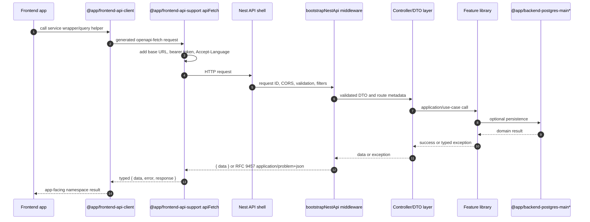

# API conventions

The backend consists of five standalone NestJS API shells. Three are the contract-bearing REST shells in the OpenAPI/contract pipeline:

- `admin-app-api`
- `user-app-api`
- `auth-app-api`

The remaining two are webhook/bot apps outside the REST contract pipeline:

- `discord-app-api`
- `telegram-bot-api`

## Health

All APIs use the shared health library `@app/backend-common-health` at `libs/backend/common/health/lib`. App shells provide app-specific health providers/config through `apps/backend/*/*-app-api/src/health.config.ts`; the shared `BaseHealthController` and `HealthService` own the endpoint set and common response shaping.

```http
GET /health
GET /health/private
GET /live
GET /ready
```

`GET /health` is the compatibility/raw health response. It is intentionally not wrapped in `{ "data": ... }`:

```json
{
  "status": "ok",
  "uptime": 12.3,
  "timestamp": "2026-01-01T00:00:00.000Z",
  "checks": []
}
```

`GET /live`, `GET /ready`, and `GET /health/private` return the shared envelope shape:

```json
{
  "data": {
    "app": "auth-app-api",
    "status": "ok",
    "uptime": 12.3,
    "timestamp": "2026-01-01T00:00:00.000Z",
    "dependencies": [],
    "checks": []
  }
}
```

Checks can include `name`, `status`, `required`, `durationMs`, and sanitized `details`. `/ready` returns HTTP 503 when any required readiness indicator reports `error`; optional skipped indicators can still produce an overall `ok` response. `/health/private` is guarded by the private-network health guard.

Probe policy:

- local development Compose (`docker/docker-compose.yml`) uses API `/ready`;
- production Compose (`docker/docker-compose.prod.yml`) uses API `/ready`;
- Helm API workloads use `/live` and `/ready`;
- frontend nginx containers use `/nginx-health`.

## Bootstrap and security baseline

`libs/backend/common/bootstrap/lib` exposes `bootstrapNestApi()`. It applies:

- Helmet security middleware
- raw request-body capture for webhook/signature use cases
- cookie parsing from `COOKIE_SECRET`
- deny-all `robots.txt` responses
- extended query parsing and trust-proxy configuration
- request IDs and structured completion logs
- strict `createValidationPipe` validation with transform, whitelist, and forbid-non-whitelisted settings
- `ExceptionsResponseTransformer` and `ExceptionsFilter` response mapping
- CORS from explicit app options or `CORS_ORIGINS`/`CORS_ORIGIN`
- production CORS that does not reflect arbitrary origins when no origin is configured
- optional Swagger/OpenAPI docs from `libs/backend/common/swagger/lib`

## Result responses and RFC 9457 Problem Details

`libs/backend/common/response/lib` exposes the response mapper layer for:

- `{ data }` success responses
- RFC 9457 `application/problem+json` problem responses
- mapping `neverthrow` results to API responses
- global `ExceptionsResponseTransformer` and `ExceptionsFilter` wiring from bootstrap

`libs/backend/common/exception/lib` is the singular exception foundation. Its public alias is `@app/backend-common-exception`, its path is `libs/backend/common/exception/lib`, and its Nx project name is `@app/backend-common-exception`. Do not add an alternate exception library alias or path.

Problem Details responses preserve RFC 9457 wire fields: `type`, `title`, `status`, `detail`, and `instance`. Generic HTTP errors use `about:blank`; documented product problem types use stable `https://<root-domain>/problems#<code>` identities from `@app/common-problem-details`, and `/problems` resolves to their human-readable registry. The HTTP and body statuses always match. `instance` is an absolute opaque occurrence URI, not a request path. Validation responses use the `errors[]` extension with `{ detail, pointer }`, where `pointer` is a JSON Pointer URI fragment such as `#/profile/email`.

Only human-readable `title`, `detail`, and validation issue `detail` values are localized. `type`, the documented `code` extension, `status`, `instance`, and validation pointers remain machine-stable. Frontend normalization keeps the canonical URI in `type` and the short switch-friendly alias in `code`; generic `about:blank` responses receive a local `http.<status>` code. UI code reads display text only from a normalized `ApiClientError.problem` or enriched `_frontendError`; arbitrary `Error.message` and unnormalized object fields are not user-facing. Never branch on translated text or status alone when a product problem code distinguishes the case.

## Contracts and generated clients

OpenAPI JSON is committed under `apps/backend/*/*-app-api/contracts/openapi/*.json`. Shared generated contract types live under `libs/common/api-contracts/lib/src/generated`, and generated frontend clients live under `libs/frontend/api-client/lib/src/generated`. API surface changes must update the source API, exported OpenAPI JSON, shared contracts, and frontend clients together.

## OAuth foundation

`libs/backend/feature/auth/shared/lib` OAuth support is disabled by default. It can build local authorization URLs from explicit configuration, but callback exchange is intentionally left for product-specific provider wiring.

## Auth endpoints

`auth-app-api` exposes the following core credential endpoints (an illustrative subset, not the complete surface):

```http
POST /auth/register
POST /auth/login
POST /auth/refresh
GET /auth/me
POST /auth/logout
```

The full surface also includes Telegram (`/auth/telegram/*`), Discord OAuth (`/auth/discord/*`), provider-identities, link/email-verification/password-reset tokens, locale, profile preference, and problem-presentation routes; see `libs/backend/feature/auth/main/lib/src/interfaces/http`.

Register/login accept JSON `{ "email": "user@example.com", "password": "password123", "displayName": "User" }` (display name is optional for login). Successful responses return `{ data: { user, accessToken, tokenType: "Bearer", expiresIn } }`, plus an optional `refreshToken` (consumed by `POST /auth/refresh`) and optional session metadata (`amr`, `authProvider`, `authChannel`, `authTime`, `externalIdentityId`). Use the bearer token against `GET /profile/me` on `user-app-api` and `GET /admin/profile/me` on `admin-app-api`.

Admin access is fail-closed. Bootstrap requires `ADMIN_BOOTSTRAP_ENABLED=true` (and, for non-default tenants, `ADMIN_BOOTSTRAP_TENANT_IDS`); `ADMIN_BOOTSTRAP_EMAILS` does not grant admin by itself. A matching registered email then receives the `admin` role, which grants the full admin permission catalog (dashboard, profile, users, roles, audit, and settings permissions plus the break-glass `admin:manage:all`) as defined in the role-permission matrix.

## Request flow diagram



Frontend code should enter the flow through `@app/frontend-api-client` wrappers. RFC 9457 Problem Details responses come from the singular `@app/backend-common-exception` foundation and shared response mapping.
