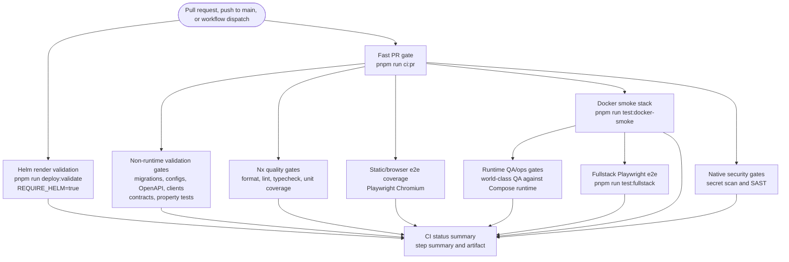

# CI observability

This repository keeps CI results visible from multiple places so failures remain diagnosable even when the GitHub check-run API is unavailable to a local token or automation account.

## PR gate order

The `CI` workflow starts with a dedicated `Fast PR gate (check:fast)` job. It runs:

```bash
pnpm run check:fast
```

That command covers Prettier, Nx lint, Nx typecheck, and unit tests. Longer quality, browser, Docker smoke, runtime QA, and fullstack e2e jobs wait behind that fast gate so common failures surface early.

The `Helm render validation` job also runs the dependency-free deployment configuration assertions before Helm setup and rendering:

```bash
node scripts/validate-deployment-config.mjs
node scripts/validate-helm-rate-limit-config.mjs
```

Those assertions keep Docker Compose, Helm, environment examples, nginx routing, runtime hardening, production secret handling, and Helm Redis-backed rate-limit drift visible in the same early CI surface as the Helm render gate.

## CI pipeline map



## Current green gate inventory

The expected green CI surface is intentionally broader than a single `check`
command. Treat these workflows/jobs as the supported signal set when reviewing a
release branch or a consolidator PR:

| Surface                         | Workflow/job                                                    | Command or provider                                        | Evidence                                                                   |
| ------------------------------- | --------------------------------------------------------------- | ---------------------------------------------------------- | -------------------------------------------------------------------------- |
| Supported lockfile audit        | `dependency-review.yml` / `Supported lockfile audit`            | `pnpm run audit:ci` after `pnpm install --frozen-lockfile` | Step summary and `supported-lockfile-audit-summary` artifact               |
| Secret scan                     | `ci.yml` / `Native security gates`                              | `pnpm run test:security:secrets`                           | Security test artifacts under `test-results/security-secrets/**`           |
| Native SAST                     | `ci.yml` / `Native security gates`                              | `pnpm run test:security:sast`                              | Same security job artifacts                                                |
| Docker smoke                    | `ci.yml` / `Docker smoke stack`                                 | `pnpm run test:docker-smoke`                               | Docker smoke job result and logs                                           |
| Fullstack Playwright            | `ci.yml` / `Fullstack Playwright e2e`                           | `pnpm run test:fullstack`                                  | Playwright/fullstack artifacts                                             |
| Runtime QA/ops                  | `ci.yml` / `Runtime QA/ops gates`                               | `pnpm run test:world-class` with real runtime env          | `ops-gate-artifacts` and runtime stack logs                                |
| CodeQL                          | `codeql.yml` / `Analyze JavaScript/TypeScript`                  | GitHub CodeQL action                                       | Security tab plus `codeql-summary` artifact                                |
| Image release supply chain      | `release-images.yml` / `Build, scan, and sign *`                | Buildx, SBOM, Trivy SARIF, cosign                          | SBOM artifacts, uploaded SARIF, signed image digests                       |
| GitGuardian external monitoring | External GitGuardian integration, when enabled for the org/repo | Provider-managed secret detection                          | GitGuardian dashboard/alerts; not a replacement for the native secret scan |

## Status summaries

The CI workflow has a final `CI status summary` job with `if: always()`. It writes a Markdown table of every CI job result to the GitHub step summary and uploads the same table as the `ci-status-summary` artifact.

CodeQL and Dependency Review also write step summaries and upload small Markdown artifacts. Use these summaries when the Checks tab, check-run API, or local personal access token permissions do not expose detailed check results.

## Workflow status pages

Use the GitHub Actions workflow pages for current run history and badges when repository readers have authenticated access:

- CI: `.github/workflows/ci.yml`
- CodeQL: `.github/workflows/codeql.yml`
- Dependency review: `.github/workflows/dependency-review.yml`

Workflow-level links are preferred so private-repository readers can click through to the authenticated run history.

## Dependabot labels

Dependabot can only apply labels that already exist. The GitHub Actions update configuration uses the existing `dependencies` label and a `ci` commit-message prefix instead of requesting a missing `ci` label.
