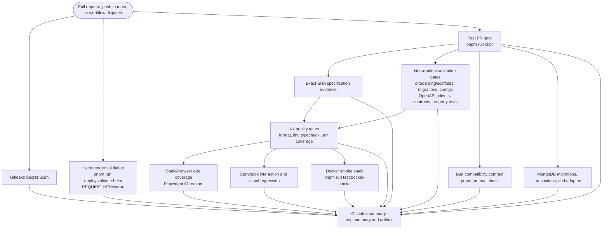

# CI observability

This repository keeps CI results visible from multiple places so failures remain diagnosable even when the GitHub check-run API is unavailable to a local token or automation account.

## PR gate order

The `CI` workflow starts with a dedicated `Fast PR gate (ci:pr)` job. It runs:

```bash
pnpm run ci:pr
```

That command covers tooling/static checks, documentation-contract checks
(`docs:check`), locale artifact freshness (`i18n:catalogs:check`),
specification validation (`spec:validate`), changed-file formatting, native
secret and SAST scans, and the production dependency audit. The later Nx
quality job owns full formatting, lint, typecheck, unit/component coverage,
and builds.

The `Helm render validation` job runs workflow hardening and CI gate parity
checks, then materializes the selected Helm deployment with `pnpm nrb setup`
and validates it through `pnpm run deploy:validate:helm` with
`REQUIRE_HELM=true`. The dependency-free deployment configuration assertions
run inside that bundle rather than as separate steps:

```bash
node scripts/validate-deployment-config.mjs --mode=helm
node scripts/validate-helm-rate-limit-config.mjs
```

Those assertions keep Docker Compose, Helm, environment examples, nginx routing, runtime hardening, production secret handling, and Helm Redis (`@redis/client`) rate-limit drift visible in the same early CI surface as the Helm render gate.

## CI pipeline map


```mermaid
flowchart TD
  start([Pull request, push to main, or workflow dispatch])
  gitleaks[Gitleaks Secret Scan]
  helm[Helm render validation<br/>pnpm run deploy:validate:helm<br/>REQUIRE_HELM=true]
  fast[Fast PR gate<br/>pnpm run ci:pr]
  spec[Exact-SHA specification evidence]
  nonruntime[Non-runtime validation gates<br/>onboarding/scaffolds, migrations, configs<br/>OpenAPI, clients, contracts, property tests]
  buncompat[Bun compatibility contract<br/>pnpm run bun:check]
  mongo[MongoDB migrations, transactions, and adapters]
  quality[Nx quality gates<br/>format, lint, typecheck, unit coverage]
  browser[Static/browser e2e coverage<br/>Playwright Chromium]
  visual[Storybook interaction and visual regression]
  docker[Docker smoke stack<br/>pnpm run test:docker-smoke]
  summary[CI status summary<br/>step summary and artifact]
  start --> gitleaks
  start --> helm
  start --> fast
  fast --> spec
  fast --> nonruntime
  fast --> buncompat
  fast --> mongo
  spec --> quality
  nonruntime --> quality
  quality --> browser
  quality --> visual
  quality --> docker
  gitleaks --> summary
  helm --> summary
  fast --> summary
  spec --> summary
  nonruntime --> summary
  buncompat --> summary
  mongo --> summary
  quality --> summary
  browser --> summary
  visual --> summary
  docker --> summary
```

The runtime QA/ops gates (`pnpm run test:world-class` against a live runtime
stack) and the compiled-image fullstack e2e (`pnpm run test:fullstack`) are
not `ci.yml` jobs: both run in the `Modern QA presets` job of
`quality-presets.yml` (nightly cron and manual dispatch).

## Current green gate inventory

The expected green CI surface is intentionally broader than a single `check`
command. Treat these workflows/jobs as the supported signal set when reviewing a
release branch or a consolidator PR:

| Surface                          | Workflow/job                                                    | Command or provider                                                                | Evidence                                                                   |
| -------------------------------- | --------------------------------------------------------------- | ---------------------------------------------------------------------------------- | -------------------------------------------------------------------------- |
| Supported lockfile audit         | `dependency-review.yml` / `Supported lockfile audit`            | `pnpm run audit:ci` after `pnpm install --frozen-lockfile`                         | Step summary and `dependency-review-summary` artifact                      |
| Gitleaks secret scan             | `ci.yml` / `Gitleaks Secret Scan`                               | gitleaks over the tracked tree                                                     | Gitleaks job result                                                        |
| Secret scan                      | `ci.yml` / `Fast PR gate (ci:pr)`                               | `pnpm run test:security:secrets`                                                   | Included in `ci:pr`; no separate native-security job                       |
| Native SAST                      | `ci.yml` / `Fast PR gate (ci:pr)`                               | `pnpm run test:security:sast`                                                      | Included in `ci:pr`; no separate native-security job                       |
| Exact-SHA specification evidence | `ci.yml` / `Exact-SHA specification evidence`                   | `pnpm run spec:verify -- --lane pr\|main` against the base ref                     | `exact-sha-specification-evidence` artifact                                |
| Onboarding/scaffold contract     | `ci.yml` / `Non-runtime validation gates`                       | `pnpm run onboarding:verify`                                                       | Exact preset closures plus generated app/library builds and tests          |
| Bun compatibility                | `ci.yml` / `Bun compatibility contract`                         | `pnpm run bun:check` per selected-closure matrix                                   | bun-compat job result and logs                                             |
| MongoDB validation               | `ci.yml` / `MongoDB migrations, transactions, and adapters`     | MongoDB migration ledger, transaction/adapter, and provider-wiring component tests | mongodb-validation job result and logs                                     |
| Docker smoke                     | `ci.yml` / `Docker smoke stack`                                 | `pnpm run test:docker-smoke`                                                       | Docker smoke job result and logs                                           |
| Fullstack Playwright             | `quality-presets.yml` / `Modern QA presets`                     | `pnpm run test:fullstack` against compiled images                                  | `quality-preset-results` artifact (nightly/dispatch, not the PR path)      |
| Runtime QA/ops                   | `quality-presets.yml` / `Modern QA presets`                     | `pnpm run quality:presets` with a live runtime stack                               | `quality-preset-results` artifact (nightly/dispatch, not the PR path)      |
| CodeQL                           | `codeql.yml` / `Analyze JavaScript/TypeScript`                  | GitHub CodeQL action                                                               | Security tab plus `codeql-summary` artifact                                |
| Image release supply chain       | `release-images.yml` / `Build, scan, and sign *`                | Buildx, SBOM, Trivy SARIF, cosign                                                  | SBOM artifacts, uploaded SARIF, signed image digests                       |
| GitGuardian external monitoring  | External GitGuardian integration, when enabled for the org/repo | Provider-managed secret detection                                                  | GitGuardian dashboard/alerts; not a replacement for the native secret scan |

### Scheduled and dispatch workflows

These workflows run on schedules or manual dispatch instead of the PR path, so
they never appear in PR gate order. Treat them as the durable background signal
set for visual regression, assurance evidence, and supply-chain scoring:

| Workflow                        | File                         | Trigger                            | What it proves                                                                                                                                                                             |
| ------------------------------- | ---------------------------- | ---------------------------------- | ------------------------------------------------------------------------------------------------------------------------------------------------------------------------------------------ |
| Quality presets                 | `quality-presets.yml`        | nightly cron + `workflow_dispatch` | Storybook visual browser/mobile matrix drift against reviewed baselines, plus the Modern QA presets job (world-class runtime/ops gates and compiled-image Docker smoke and fullstack e2e). |
| OpenSSF Scorecard               | `scorecard.yml`              | weekly cron + `main` push          | Supply-chain posture score with results published to the Security tab.                                                                                                                     |
| Nightly specification assurance | `spec-assurance-nightly.yml` | nightly cron + `workflow_dispatch` | Fresh exact-SHA requirement evidence across nightly lanes with a runtime stack.                                                                                                            |
| Runtime specification assurance | `spec-assurance-runtime.yml` | `workflow_dispatch`                | On-demand runtime exact-SHA assurance dossier.                                                                                                                                             |

Use the same [Workflow status pages](#workflow-status-pages) pattern to follow
run history for these files.

## Status summaries

The CI workflow has a final `CI status summary` job with `if: always()`. It writes a Markdown table of every CI job result to the GitHub step summary and uploads the same table as the `ci-status-summary` artifact.

CodeQL and Dependency Review also write step summaries and upload small Markdown artifacts. Use these summaries when the Checks tab, check-run API, or local personal access token permissions do not expose detailed check results.

## Workflow status pages

Use the GitHub Actions workflow pages for current run history and badges when repository readers have authenticated access:

- CI: `.github/workflows/ci.yml`
- CodeQL: `.github/workflows/codeql.yml`
- Dependency review: `.github/workflows/dependency-review.yml`
- Quality presets: `.github/workflows/quality-presets.yml`
- OpenSSF Scorecard: `.github/workflows/scorecard.yml`
- Nightly specification assurance: `.github/workflows/spec-assurance-nightly.yml`
- Runtime specification assurance: `.github/workflows/spec-assurance-runtime.yml`

Workflow-level links are preferred so private-repository readers can click through to the authenticated run history.

## Dependabot labels

Dependabot can only apply labels that already exist. The GitHub Actions update configuration uses the existing `dependencies` label and a `ci` commit-message prefix instead of requesting a missing `ci` label.
