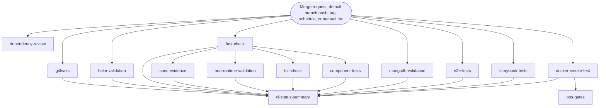

# CI observability

This repository keeps CI results visible from multiple places so failures remain diagnosable even when the GitLab pipeline API is unavailable to a local token or automation account.

## Merge-request gate order

Every merge-request pipeline opens with the cheap jobs. `fast-check` runs the git
conventions check against the merge-request base and then the aggregate PR gate:

```bash
pnpm run ci:pr
```

`ci:pr` covers tooling/static checks, documentation-contract checks
(`docs:check`), locale artifact freshness (`i18n:catalogs:check`),
specification validation (`spec:validate`), changed-file formatting, native
secret and SAST scans, and the production dependency audit.

`helm-validation` runs the CI gate-parity check and then materializes the
selected Helm deployment with `pnpm nrb setup` and validates it through
`pnpm run deploy:validate:helm` with `REQUIRE_HELM=true`. The dependency-free
deployment configuration assertions run inside that bundle rather than as
separate steps:

```bash
node scripts/validate-deployment-config.mjs --mode=helm
node scripts/validate-helm-rate-limit-config.mjs
```

Those assertions keep Docker Compose, Helm, environment examples, nginx routing, runtime hardening, production secret handling, and Helm Redis (`@redis/client`) rate-limit drift visible in the same early CI surface as the Helm render gate.

`full-check` owns the expensive sweep — full formatting, lint, typecheck,
unit/component coverage, builds, and the bundle budget. On a merge request it
runs `nx affected` against GitLab's diff-base SHA; on the default branch it runs
the `:all` variants.

## CI pipeline map


```mermaid
flowchart TD
  start([Merge request, default-branch push, tag, schedule, or manual run])
  gitleaks[gitleaks]
  depreview[dependency-review]
  helm[helm-validation]
  fast[fast-check]
  spec[spec-evidence]
  nonruntime[non-runtime-validation]
  full[full-check]
  component[component-tests]
  mongo[mongodb-validation]
  browser[e2e-tests]
  storybook[storybook-tests]
  docker[docker-smoke-test]
  summary[ci-status-summary]
  start --> gitleaks
  start --> depreview
  start --> helm
  start --> fast
  start --> mongo
  start --> storybook
  start --> browser
  start --> docker
  fast --> spec
  fast --> nonruntime
  fast --> full
  fast --> component
  docker --> ops[ops-gates]
  gitleaks --> summary
  helm --> summary
  fast --> summary
  spec --> summary
  nonruntime --> summary
  full --> summary
  component --> summary
  mongo --> summary
  browser --> summary
  storybook --> summary
  docker --> summary
```

The runtime QA/ops gates (`pnpm run quality:presets` against a live runtime
stack) and the compiled-image fullstack e2e (`pnpm run test:fullstack`) are not
merge-request jobs: they run in `ops-gates`, `docker-fullstack`, and
`docker-fullstack-mongodb` on scheduled or manual pipelines.

## Current green gate inventory

The expected green CI surface is intentionally broader than a single `check`
command. Treat these jobs as the supported signal set when reviewing a release
branch or a consolidator merge request:

| Surface                          | Job                                                             | Command or provider                                                                | Evidence                                                                   |
| -------------------------------- | --------------------------------------------------------------- | ---------------------------------------------------------------------------------- | -------------------------------------------------------------------------- |
| Supported lockfile audit         | `dependency-review` (merge requests)                            | `pnpm run audit:ci` after `pnpm install --frozen-lockfile`                         | Job result                                                                 |
| Gitleaks secret scan             | `gitleaks`                                                      | gitleaks over the tracked tree                                                     | `gl-security-report.json` secret-detection artifact                        |
| Secret scan                      | `fast-check`                                                    | `pnpm run test:security:secrets`                                                   | Included in `ci:pr`; no separate native-security job                       |
| Native SAST                      | `fast-check`                                                    | `pnpm run test:security:sast`                                                      | Included in `ci:pr`; no separate native-security job                       |
| GitLab-managed scanners          | `include: Security/*` templates                                 | SAST, Dependency Scanning, Secret Detection, Container Scanning                    | GitLab security reports                                                    |
| Exact-SHA specification evidence | `spec-evidence`                                                 | `pnpm run spec:verify -- --lane pr\|main` against the base ref                     | `test-results/spec-evidence/` artifact                                     |
| Onboarding/scaffold contract     | `non-runtime-validation`                                        | `pnpm run onboarding:verify`                                                       | Exact preset closures plus generated app/library builds and tests          |
| MongoDB validation               | `mongodb-validation`                                            | MongoDB migration ledger, transaction/adapter, and provider-wiring component tests | mongodb-validation job result and logs                                     |
| Docker smoke                     | `docker-smoke-test`                                             | `pnpm run docker:prod:config:check`, `node scripts/validate-compose-modes.mjs`     | Docker smoke job result and logs                                           |
| Fullstack Playwright             | `docker-fullstack` / `docker-fullstack-mongodb`                 | `pnpm run test:fullstack` against compiled images                                  | Scheduled/manual lanes, not the merge-request path                         |
| Runtime QA/ops                   | `ops-gates`                                                     | `pnpm run quality:presets` with a live runtime stack                               | Scheduled/manual lanes, not the merge-request path                         |
| CodeQL                           | Not shipped                                                     | GitHub's default code-scanning setup reads `.github/codeql/codeql-config.yml`      | Security tab; no pipeline job carries it                                   |
| Image release supply chain       | `release-images`                                                | Buildx, Syft SBOM, Trivy SARIF, cosign                                             | SBOM/SARIF/attestation artifacts, signed image digests                     |
| GitGuardian external monitoring  | External GitGuardian integration, when enabled for the org/repo | Provider-managed secret detection                                                  | GitGuardian dashboard/alerts; not a replacement for the native secret scan |

### Scheduled and manually dispatched jobs

These jobs run on schedules or manual dispatch instead of the merge-request
path, so they never appear in MR gate order. Treat them as the durable
background signal set for visual regression and assurance evidence:

| Job                        | Trigger                   | What it proves                                                                                                                                                                             |
| -------------------------- | ------------------------- | ------------------------------------------------------------------------------------------------------------------------------------------------------------------------------------------ |
| `visual-regression-matrix` | nightly cron + manual run | Storybook visual browser/mobile matrix drift against reviewed baselines, plus the Modern QA presets job (world-class runtime/ops gates and compiled-image Docker smoke and fullstack e2e). |
| `spec-evidence-nightly`    | nightly cron + manual run | Fresh exact-SHA requirement evidence across nightly lanes with a runtime stack.                                                                                                            |
| `spec-evidence-runtime`    | manual run                | On-demand runtime exact-SHA assurance dossier.                                                                                                                                             |

## Status summaries

GitLab starts a job only once every job in its `needs:` list has succeeded, so
the final `ci-status-summary` job reaching `success` is itself the proof that
every merge-required gate passed. It also re-runs
`node scripts/ci/check-pipelines.mjs`, so a gate added to `scripts/ci/gates.json`
without a job in `.gitlab-ci.yml` fails the pipeline instead of passing silently.
Naming every job in the protected-branch rule instead would silently stop
covering whatever is added next.

## Pipeline run history

Use the GitLab pipeline pages for current run history when repository readers
have authenticated access. Every merge-blocking lane lives in `.gitlab-ci.yml`,
and `scripts/ci/gates.json` names the job that executes each one. Pipeline-level
links are preferred so private-repository readers can click through to the
authenticated run history.

## Dependabot labels

Dependabot can only apply labels that already exist. The GitHub Actions update configuration uses the existing `dependencies` label and a `ci` commit-message prefix instead of requesting a missing `ci` label.
