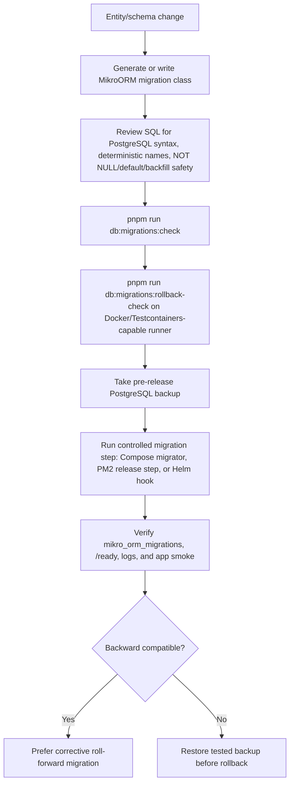

# Database migration standards

Database changes are production changes. Keep migrations explicit, reversible where practical, and safe to review.

This repository currently uses PostgreSQL through MikroORM. The rules below are enforced by `pnpm run db:migrations:check` for committed migration files under `libs/**/migrations`.

## Column definitions

- Columns must be declared with `NOT NULL` in migrations.
- If a value can be absent at the application boundary, persist a deliberate sentinel/default instead of leaving the database column nullable.
- New columns must include a backfill/default path in the same migration before relying on application writes.
- Use `VARCHAR(n)` for enum-like values. Do not create database `ENUM` types.
- Use `CHECK` constraints for allowed enum-like values and name them `ck__{table}__{rule}`.

Examples:

```sql
"status" varchar(32) not null default 'active'
constraint "ck__auth_users__status" check ("status" in ('active', 'disabled', 'invited'))
```

## Constraint and index names

Use deterministic names so diffs, rollbacks, and operational debugging stay predictable.

- Normal index: `ix__{table}__{columns}`
- Unique index or unique constraint: `uq__{table}__{columns}`
- Foreign key: `fk__{table}__{column}`
- Check constraint: `ck__{table}__{rule}`

Examples:

```sql
constraint "uq__auth_users__email" unique ("email")
constraint "fk__sessions__auth_user_id" foreign key ("auth_user_id") references "auth_users" ("id")
create index "ix__auth_users__status" on "auth_users" ("status")
```

## PostgreSQL migration lifecycle



## PostgreSQL DDL safety

PostgreSQL is the canonical database for this repository. Migrations must use
PostgreSQL-compatible SQL emitted through MikroORM migration classes and must not
include MySQL/MariaDB operational syntax. In particular, `ALGORITHM=INSTANT` and
`LOCK=DEFAULT` are forbidden in committed migrations; they are useful guard terms
only because the checker rejects them as non-PostgreSQL syntax.

For PostgreSQL, keep add-column migrations metadata-only where possible by using
constant defaults, backfill deliberately, avoid table rewrites on large tables,
and split risky changes into expand/backfill/contract phases when needed.

## Validation

Run this before opening a PR that touches migrations:

```bash
pnpm run db:migrations:check
pnpm run check
```

The checker rejects nullable migration columns, database enums, non-standard index/unique/FK/check names, and forbidden MySQL/MariaDB-only syntax such as `ALGORITHM=INSTANT` or `LOCK=DEFAULT`.
