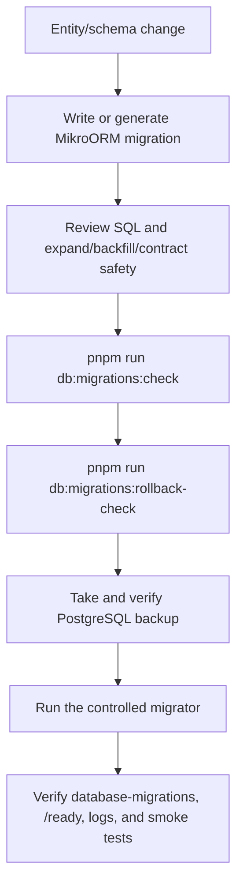

# Database migration standards

Database changes are production changes. PostgreSQL and MongoDB are mutually
exclusive, first-class durable providers; a workspace that needs durable data
must select exactly one. Existing `minimal`, `web`, `fullstack`, `bots`, and
`enterprise` presets remain PostgreSQL-backed unless the selection is explicitly
replaced with MongoDB.

```bash
# Keep the preset's PostgreSQL provider.
pnpm nrb setup --preset fullstack --non-interactive

# Select the same apps with MongoDB instead of PostgreSQL.
pnpm nrb setup --replace \
  --app auth-app-api --app user-app-api \
  --capability mongodb --non-interactive
```

`DATABASE_ENGINE` and durable `AUTH_PERSISTENCE` must agree. The database CLI
dispatches migrations, reset, seed, backup, restore, and restore drills to the
selected provider. When neither selector is set, CLI compatibility defaults to
PostgreSQL; setup-generated environments always set both explicitly.

## Shared behavioral contract

Both providers preserve product behavior and invariants, not identical physical
database semantics:

- tenant scope is present in every owned query and uniqueness boundary;
- related durable mutations, audit records, and outbox records commit atomically;
- concurrency-sensitive writes use database-native serialization or compare-and-set;
- delivery and command workers use leases plus claim-token fencing so stale workers
  cannot complete reclaimed work;
- migrations are explicit, ordered, verified, and run once before application rollout;
- external NATS publication and email/provider calls remain at-least-once outbox
  workflows. They are never part of a distributed database/transport transaction.

Provider parity does not mean physical parity. MongoDB has no foreign keys,
savepoints, or PostgreSQL advisory locks. Its adapters use compound unique indexes,
strict validators, expected-revision compare-and-set, tenant serialization
documents, and expiring leases instead. TTL deletion is asynchronous, so runtime
queries must continue to enforce logical expiry. MongoDB collection, validator,
and index DDL is not transactional.

## PostgreSQL lifecycle

PostgreSQL uses MikroORM migration classes under
`libs/backend/postgres/main/<scope>/lib/src/**/migrations` and records applied
state in `mikro_orm_migrations`.


```mermaid
flowchart TD
  model[Entity/schema change] --> migration[Write or generate MikroORM migration]
  migration --> review[Review SQL and expand/backfill/contract safety]
  review --> check[pnpm run db:migrations:check]
  check --> rollback[pnpm run db:migrations:rollback-check]
  rollback --> backup[Take and verify PostgreSQL backup]
  backup --> release[Run the controlled migrator]
  release --> ready[Verify database-migrations, /ready, logs, and smoke tests]
```

### Column, constraint, and index rules

- Declare columns `NOT NULL`; use a deliberate sentinel/default when absence is
  valid at the application boundary.
- Backfill new values before relying on application writes.
- Use `VARCHAR(n)` plus named `CHECK` constraints instead of database `ENUM`.
- Name indexes `ix__{table}__{columns}`, unique constraints
  `uq__{table}__{columns}`, foreign keys `fk__{table}__{column}`, and checks
  `ck__{table}__{rule}`.
- PostgreSQL truncates identifiers to 63 bytes without warning, so a longer name
  creates an object the migration cannot later drop by the name it declared.
  Index and unique-constraint names past that limit are therefore cut to 55
  bytes and suffixed with `__{8 hex}`, a digest of the full name that keeps two
  otherwise-identical prefixes distinct. `pnpm run db:migrations:check` computes
  the expected name with `canonicalIndexName` and prints it on mismatch, so copy
  the name it reports rather than deriving the suffix by hand. Author-chosen
  `fk__`/`ck__` names get no automatic suffix and are simply rejected past 63
  bytes — shorten them.
- Keep add-column changes metadata-only where practical and split risky changes
  into expand/backfill/contract phases.
- Do not commit MySQL/MariaDB syntax such as `ALGORITHM=INSTANT` or
  `LOCK=DEFAULT`.

## MongoDB topology contract

The supported local, Compose, Helm, backup, and restore contract uses an
unsharded replica set. Standalone MongoDB is rejected because auth,
notifications, audit, outbox, and generated persistence require transactions.
The local and bundled single-server services initialize a one-node replica set;
this enables transactions but is not high availability. Production should use a
managed or operator-owned multi-node replica set with a writable primary,
logical sessions, retryable writes, majority durability, tested backup/PITR, and
an explicit `replicaSet` URI option.

The shared topology validator can recognize a transaction-capable `mongos` when
no replica-set name is pinned. That lower-level acceptance is not an integrated
support claim: setup, database operations, production Compose, and Helm require
an explicit replica-set identity, so sharded deployments are outside the
documented first-class topology.

Startup rejects standalone, direct-connection, load-balanced, session-less,
non-primary, replica-set-mismatched, and transaction-incompatible deployments.
Readiness exposes the required `database` and `database-transactions` checks
without returning credentials or raw driver errors.

## MongoDB transaction semantics

Use `runInMongoTransaction()` for every related multi-document mutation and pass
its `ClientSession` to every operation. A transaction uses:

- snapshot read concern;
- majority write concern;
- primary read preference;
- bounded retries for `TransientTransactionError` and bounded commit retries for
  `UnknownTransactionCommitResult` (two by default, ten maximum);
- no parallel operations inside one session.

Auth administration serializes tenant-wide invariants by incrementing one
tenant serialization document inside the transaction. Revisioned settings use
expected-revision CAS. Mutation, audit, and outbox documents share the same
transaction. Notification queue claims are individually atomic CAS operations;
completion must match the current claim token, so an expired and reclaimed lease
fences the stale worker. Provider calls happen outside the transaction and may
be repeated after uncertain failure; idempotency and persisted retry state are
required.

## MongoDB migrations

MongoDB migrations are native-driver objects under
`libs/backend/mongodb/main/<scope>/lib/src/migrations`. They have a strictly
increasing `YYYYMMDDHHmmss_description` ID, an `up()` method, and a `verify()`
method. `pnpm db:migrate` runs the ID-sorted built-in and generator-registered
feature list and records majority-acknowledged entries in the strictly validated
`mongo_migrations` ledger.

Every migration must:

- create or modify collections, strict JSON Schema validators, and deterministic
  indexes idempotently;
- tolerate replay because collection/index/validator DDL cannot be wrapped in a
  transaction;
- verify exact validator, validation level/action, index key order, uniqueness,
  partial filters, collation, and TTL options before writing the ledger entry;
- reject unknown ledger entries and changed names for an existing ID;
- prefer a corrective roll-forward migration. MongoDB migrations do not offer
  the PostgreSQL up/down rollback contract.

TTL indexes schedule eventual cleanup rather than immediate deletion. Code that
loads sessions, verification records, claims, or leases must still compare the
expiry timestamp.

## Generators

Feature and backend `data-access` library generators accept
`--database postgres|mongodb`. They derive the provider from
`.nrb/workspace.json` when exactly one durable provider is selected, reject an
explicit mismatch, and retain PostgreSQL only as the no-selection compatibility
default for direct generator use.

```bash
pnpm nrb add feature invoices \
  --api-app user-app-api --frontend-app user-app \
  --database mongodb --dry-run
pnpm nrb add lib ledger \
  --kind backend --type data-access --scope ledger \
  --database mongodb \
  --description "Persists tenant ledger records behind the backend ledger port." \
  --dry-run
```

MongoDB feature scaffolds create a native collection validator, deterministic
indexes, a transactional repository, a ledger-backed migration, deterministic
migrator registration, component-test coverage, and the canonical
`libs/backend/mongodb/main/<scope>/lib` ownership path. Collection DDL runs only
through the migrator, never from application module startup. PostgreSQL scaffolds
create MikroORM entities, repositories, and a reversible migration.

## Operations and validation

```bash
pnpm db:migrate
pnpm db:seed -- --dry-run
pnpm db:backup -- --dry-run
pnpm db:restore -- --input <provider-backup> --dry-run --force
pnpm db:restore:drill -- --ci --dry-run
pnpm run db:migrations:check
```

These local commands require a current setup-selected closure and verify that
environment selectors agree with its durable provider. The final deployment
migrator has no `.nrb` filesystem state: it dispatches only when
`DATABASE_ENGINE` and `AUTH_PERSISTENCE` are both present and select the same
`postgres` or `mongodb` provider. This deployment-only resolver does not weaken
the fresh-closure requirement for local commands.

MongoDB backup/restore uses pinned MongoDB Database Tools locally or the pinned
Docker fallback and emits gzip archives; deployment-wide backups use oplog
capture/replay through `MONGODB_BACKUP_RESTORE_URI` or its `_FILE` form, while
database-scoped local operations use the runtime URI and namespace filtering.
The deployment-wide URI has no database path, authenticates against `admin`,
and belongs to a distinct principal with the built-in `backup` and `restore`
roles. MongoDB additionally requires that principal to have a custom role with
`anyAction` on `anyResource` for `--oplogReplay`; no runtime or migration
principal receives it. Runtime and migration principals remain separate and limited to
`readWrite`, and `readWrite` plus `dbAdmin`, on the application database.
PostgreSQL uses custom-format dumps. Reset, seed, and restore retain the local
safety guard unless the operator deliberately supplies `--force`; restore also
requires `--yes` outside dry-run mode.

Run `pnpm run db:migrations:rollback-check` only for PostgreSQL migration
up/down/up proof. For MongoDB, run focused migration unit/component tests against
a replica-set Testcontainer and prove idempotent apply plus verification. Before
either provider reaches production, perform a real isolated restore drill and
record actual RPO/RTO.
