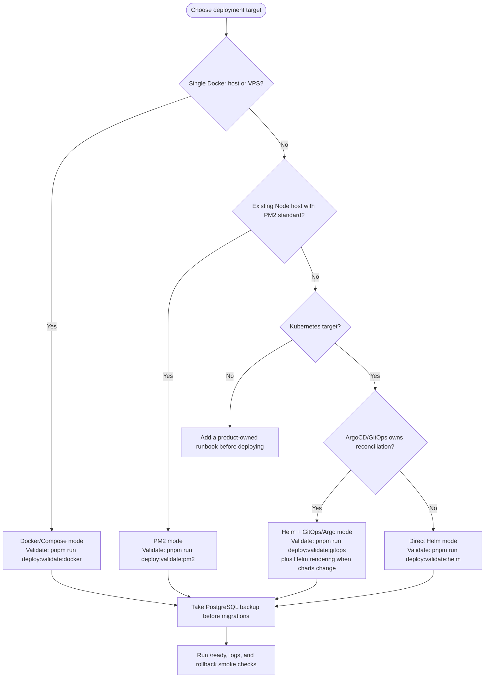

# Deployment and local stack readiness

Deployment is intentionally split into optional, composable modes. Use the mode
that matches the target environment; do not treat Helm or Kubernetes as a global
requirement for this repository.

| Mode               | Use when                                                              | No-deploy validation                                                            | Extra prerequisites                                                              |
| ------------------ | --------------------------------------------------------------------- | ------------------------------------------------------------------------------- | -------------------------------------------------------------------------------- |
| Docker/Compose     | Local full-stack checks or one-server production                      | `pnpm run deploy:validate:docker`                                               | Docker Engine with the Compose plugin for actual runs                            |
| PM2                | A Node process manager deployment outside this repo's default configs | `pnpm run deploy:validate:pm2`                                                  | Optional `ecosystem.config.{js,cjs,mjs}`; validation is a no-op until one exists |
| Helm               | Direct Kubernetes release from the app chart                          | `pnpm run deploy:validate:helm` or `REQUIRE_HELM=true pnpm run deploy:validate` | Install Helm 3 for strict render/lint validation and actual Helm deployment      |
| Helm + GitOps/Argo | ArgoCD applies the app chart from Git                                 | `pnpm run deploy:validate:gitops` plus Helm validation when rendering charts    | ArgoCD and cluster platform services supplied by the platform repo               |

`pnpm run deploy:validate` is a generic no-deploy bundle. It runs static
Docker/Compose checks, GitOps checks when the ArgoCD manifest exists, PM2 checks
when an ecosystem config exists, and Helm static checks. If Helm is not installed,
the generic command skips Helm render validation with a clear message. Strict Helm
rendering runs only for `pnpm run deploy:validate:helm`,
`node scripts/deploy-validate.mjs --mode=helm`, or
`REQUIRE_HELM=true pnpm run deploy:validate`.

All validation commands in this section are preflight checks only. They do not
start containers, apply Kubernetes manifests, sync ArgoCD, push images, or deploy
traffic.

## Deployment mode decision tree



The decision is per environment. A repository can keep all validation commands
green while only one or two modes are used in production. Install Helm only
for the Helm branches of the tree.

## Local development flow

```bash
cp .env.example .env
pnpm run dev:db
pnpm run db:migrate
pnpm run dev:fullstack
```

`dev:fullstack` starts the root Postgres compose service, runs
`pnpm run db:migrate` through the MikroORM Migrator, and runs the three backend
APIs plus the three Vite frontends with local API base URL defaults.

## Database migrations and reset

```bash
pnpm run db:migrate
pnpm run db:reset
```

`db:migrate` reads `DATABASE_URL` or constructs a local URL from `POSTGRES_*`
defaults, initializes MikroORM with the auth entity plus migration class list,
and runs `orm.migrator.up()`. Applied migrations are tracked in
`mikro_orm_migrations`; the command is idempotent and no runtime path uses raw
SQL files or a `psql` loop.

`db:reset` refuses non-local or non-dev-looking database names, then uses
MikroORM schema tooling to drop app tables and `mikro_orm_migrations` before
rerunning the same MikroORM migrator.

## Docker fullstack

Docker validation scripts build Compose services serially and default
`COMPOSE_PARALLEL_LIMIT=1`, `COMPOSE_BAKE=false`, `NX_DAEMON=false`, and
`NX_PARALLEL=1` so image builds stay reliable on modest-memory CI and VPS hosts.
Override these only on larger builders.

```bash
pnpm run docker:fullstack
pnpm run test:docker-smoke
pnpm run docker:down
```

`docker/docker-compose.yml` includes Postgres health checks, a Node-based
migration service that runs `pnpm db:migrate`, backend `/health` checks for the
local development stack, frontend `/nginx-health` checks, restart policies, and
healthy dependency ordering. Production Compose uses API `/ready`; Helm uses API
`/live` and `/ready`. Frontend containers use nginx same-origin API proxying:

- `/auth/*` -> `auth-app-api:3000`
- `/profile/*` -> `user-app-api:3000`
- `/admin/*` -> `admin-app-api:3000`

This lets Docker browser calls use empty Vite API base URLs without localhost
hacks. Production Compose uses the same default unless `.env.production` opts
into standalone split-origin SPA builds with
`FRONTEND_NGINX_CONFIG=docker/nginx-spa.conf` plus a non-`same-origin`
`VITE_API_BASE_URL_MODE` value and explicit `VITE_*_API_BASE_URL` origins.
Production secrets should be supplied from a secret manager; repository values
are placeholders only.

## Docker Compose production readiness

The single-server production stack is documented in
[docker-compose-production.md](docker-compose-production.md). Before starting it,
copy `.env.production.example`, replace `IMAGE_TAG=sha-000000000000` with the
immutable `sha-<git-sha>` image tag you built, create the Docker secret files
with `chmod 600`, and run:

```bash
pnpm run deploy:validate:docker
docker compose --env-file .env.production -f docker/docker-compose.prod.yml config
node scripts/validate-docker-compose-prod.mjs
```

The validation commands above do not deploy. Actual Compose deployment requires
Docker and explicit `docker compose ... up -d` commands from
[docker-compose-production.md](docker-compose-production.md).

Do not use `latest`, `main`, `dev`, or other mutable image tags for production
Compose. If your release process pins by image digest instead, put those digest
references in a release-specific compose override and record the digest with the
source Git SHA. The repository examples intentionally contain placeholder
domains, registry names, and non-production secrets only.

Rollback for Compose is image based: record the current immutable image tag or
digest, take a database backup before migrations, restore the previous tag in
`.env.production`, and run the Compose update command. Restore the database only
when the migration is not backward compatible; otherwise roll forward with a
corrective migration.

## PM2 readiness

PM2 is an optional process-manager mode, not a built-in production default. This
repository currently has no `ecosystem.config.{js,cjs,mjs}` file, so:

```bash
pnpm run deploy:validate:pm2
```

prints a skip/no-op message and exits successfully. Add an ecosystem config only
when a product deployment actually uses PM2, keep production secrets in the
runtime environment rather than committed files, and then use the same command as
the static preflight for that config. PM2 rollback is the operator's process
manager rollback: keep the previous release directory or image tag available,
restore the previous environment, restart from the previous ecosystem config, and
handle database compatibility the same way as other modes.

## Helm and GitOps readiness

The `.helm/` chart is application-owned and optional. Install Helm only when
you choose Helm mode, run strict Helm validation, or perform an actual Helm
release:

```bash
pnpm run deploy:validate:helm
REQUIRE_HELM=true pnpm run deploy:validate
```

`deploy/argocd/application.yaml` is an optional ArgoCD starting point for the
Helm + GitOps mode:

```bash
pnpm run deploy:validate:gitops
```

The app repository owns app images, the chart, values, migration job, services,
probes, and app ingress shape. The platform repository, such as
`nmime/ansible-k8s-full-setup`, owns cluster provisioning, ArgoCD, External
Secrets/Vault, ingress controllers, DNS/TLS, databases, observability, and
backups. Keep cluster addresses, secret backends, and platform dependencies out
of app values except for references such as `secrets.existingSecret`.

Helm rollback uses `helm history` and `helm rollback` for direct releases. GitOps
rollback reverts the Git commit, image digest, or immutable tag watched by ArgoCD
and lets Argo reconcile it. For both modes, confirm migration compatibility and
restore database backups only when required.
