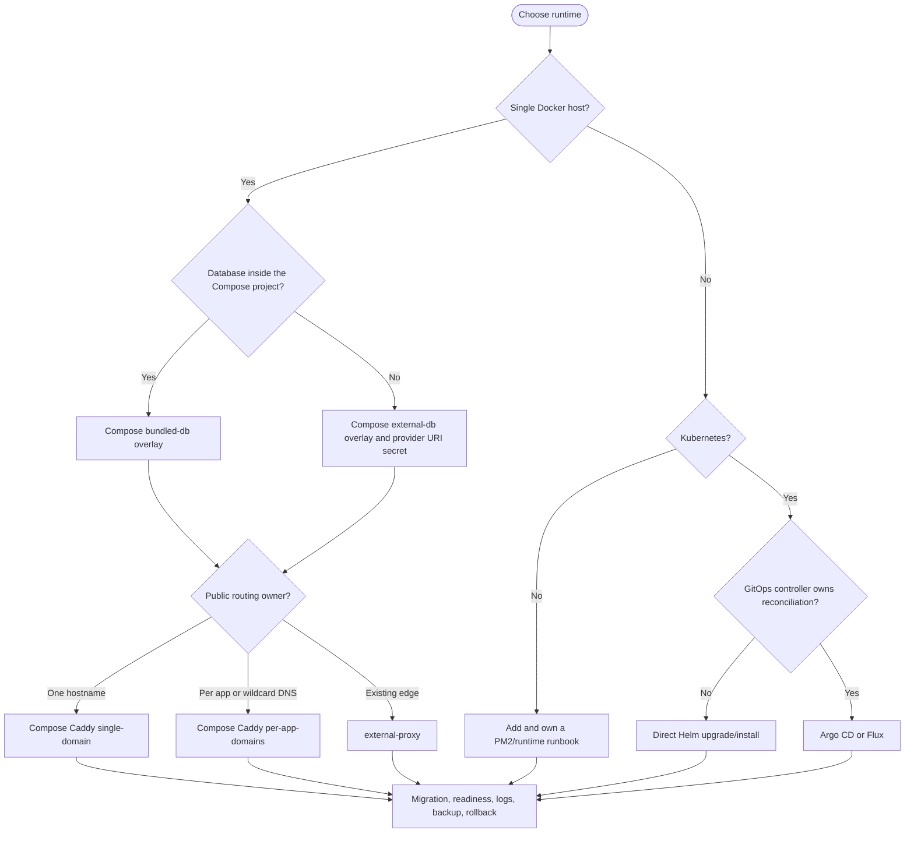

# Deployment modes

The repository ships four independently selectable production paths. Run
`pnpm nrb init` before any path so names, domains, registries, and Git sources
belong to the generated product.

| Mode                  | Entrypoint                                                            | Database                                                                 | Validation                        |
| --------------------- | --------------------------------------------------------------------- | ------------------------------------------------------------------------ | --------------------------------- |
| Compose + bundled DB  | production wrapper + bundled DB and Compose Caddy or host Nginx edge  | PostgreSQL service or one-node MongoDB replica set inside Compose        | `pnpm run deploy:validate:docker` |
| Compose + external DB | production wrapper + external DB and Compose Caddy or host Nginx edge | Secret-file URL to operator/cloud PostgreSQL or MongoDB; no Compose DB   | `pnpm run deploy:validate:docker` |
| Direct Kubernetes     | `.helm/` + `.helm/values-production.yaml`                             | Platform-managed PostgreSQL or multi-node MongoDB replica set, and Redis | `pnpm run deploy:validate:helm`   |
| Kubernetes GitOps     | Helm chart through `deploy/argocd/` or `deploy/flux/`                 | Same externally managed database contract as direct Helm                 | `pnpm run deploy:validate:gitops` |
| PM2                   | Product-owned `ecosystem.config.*` when a project explicitly adds one | Product/platform-owned                                                   | `pnpm run deploy:validate:pm2`    |

The generic `pnpm run deploy:validate` command runs all static contracts,
renders both production Compose topologies when Docker Compose is available,
validates Argo CD and Flux manifests, and renders the Helm chart when Helm is
available. CI requires the relevant CLIs, so optional local skips cannot hide a
broken deployment artifact.

These validation commands do not start containers, mutate a cluster, push an
image, or sync a controller.

Template maintainers without a product selection can explicitly run
`pnpm run deploy:validate:docker:all-reference` or
`pnpm run deploy:validate:helm:all-reference`; each materializes the PostgreSQL
reference context, verifies its config/package/workspace/lock artifacts, and
exposes that context and its generated Helm/Caddy selection to deployment
validation rather than silently choosing a product.

## Decision flow


```mermaid
flowchart TD
  start([Choose runtime]) --> host{Single Docker host?}
  host -- Yes --> db{Database inside the Compose project?}
  db -- Yes --> bundled[Compose bundled-db overlay]
  db -- No --> external[Compose external-db overlay and provider URI secret]
  bundled --> domains{Public routing owner?}
  external --> domains
  domains -- One hostname --> single[Compose Caddy single-domain]
  domains -- Per app or wildcard DNS --> multi[Compose Caddy per-app-domains]
  domains -- Existing edge --> proxy[external-proxy]
  host -- No --> k8s{Kubernetes?}
  k8s -- No --> pm2[Add and own a PM2/runtime runbook]
  k8s -- Yes --> controller{GitOps controller owns reconciliation?}
  controller -- No --> helm[Direct Helm upgrade/install]
  controller -- Yes --> gitops[Argo CD or Flux]
  single --> verify[Migration, readiness, logs, backup, rollback]
  multi --> verify
  proxy --> verify
  pm2 --> verify
  helm --> verify
  gitops --> verify
```

## Local development

Local development is separate from production Compose:

```bash
cp .env.example .env
pnpm run dev:db
pnpm run db:migrate
pnpm run dev:fullstack
```

`docker/docker-compose.yml` uses profiles selected by `pnpm nrb setup`; the
production base/overlays do not participate in that selection.

## Compose production

The production wrapper requires a fresh setup closure and targets only its
selected application images and capability services. A durable selection adds
exactly one provider overlay and the migrator; a provider-free frontend
selection adds neither and rejects database selectors.

```bash
pnpm run deploy:validate:docker
pnpm run docker:prod:config
pnpm run docker:prod:up
```

Select `DATABASE_ENGINE`, `COMPOSE_DATABASE_MODE`, `COMPOSE_DOMAIN_MODE`, and
`COMPOSE_TLS_MODE` in `.env.production`. Engine (`postgres` or `mongodb`) and
ownership (`bundled-db` or `external-db`) are independent. Bundled MongoDB is a
transaction-capable one-node replica set, not HA; production HA requires an
external managed/multi-node replica set. Compose supports one public hostname, deterministic per-app
hostnames compatible with wildcard DNS, or an operator-owned external proxy.
All modes mount credentials from files under `docker/secrets/`; production
database credentials and TLS private keys are never interpolated into the
Compose model. See
[docker-compose-production.md](docker-compose-production.md) for setup,
verification, backup, rollback, and shutdown commands.

The standalone migrator image requires matching explicit `DATABASE_ENGINE` and
`AUTH_PERSISTENCE` selectors and fails before database access when either is
missing or conflicts. Final migrator images do not contain or read `.nrb`;
closure freshness remains a source-build/release check rather than an image
startup dependency.

For an empty Ubuntu/Debian server, use the supported idempotent host Nginx +
Certbot lifecycle in
[single-server-deployment.md](single-server-deployment.md). It installs Node.js
24, the repository-pinned pnpm, Docker Engine/Compose, Nginx, Certbot, systemd
startup, exact-host or DNS-wildcard certificates, verified full-SHA image updates,
health checks, and guarded rollback without exposing app ports.

## Direct Kubernetes

The app-owned chart deploys applications, provider-dispatched migration hooks,
Services, probes, ingress, and optional app-level monitoring resources. It
references, but does not provision, production secrets or stateful platform
services. Set `database.engine` to `postgres` or `mongodb` and keep
`database.ownership=external-db`; MongoDB also requires
`database.mongodb.database`, `database.mongodb.replicaSet`, and a Secret
`MONGODB_URI` containing the same non-empty replica-set option.
MongoDB migrations and backups use separate Secrets named by
`migrations.mongodbExistingSecret` and `backups.mongodb.existingSecret`; the
backup URI is deployment-wide and authenticates against `admin`.

```bash
pnpm run deploy:validate:helm
helm upgrade --install nest-react-boilerplate .helm \
  -f .helm/values.yaml \
  -f .helm/values-production.yaml \
  -f .helm/values-selection.yaml \
  --namespace nest-react-boilerplate \
  --create-namespace --atomic --wait --timeout 10m
```

The complete runbook is [deploy/kubernetes/README.md](../deploy/kubernetes/README.md).

## Kubernetes with GitOps

Argo CD and Flux consume the same chart and production values:

```bash
pnpm run deploy:validate:gitops

# Choose one controller, never both for the same release.
kubectl apply -k deploy/argocd
# or
kubectl apply -k deploy/flux
```

The manual promotion workflow resolves the images published for one full Git
SHA and first validates that SHA's setup-generated `.nrb/closure.json` against
its live Nx graph. It intersects the closure's `releaseImages` with effective
enabled Helm ownership, including the matching generated
`.helm/values-selection.yaml`, requires every image in that set to have a candidate
digest, pins exactly those workloads, and opens a topic-branch pull request.
Missing required or extra unselected/disabled digest updates fail. Values
outside the intersection remain unchanged. Missing or stale closure metadata
also aborts promotion.
After merge, the selected controller reconciles. It does not write directly to
`main`.
See [GITOPS.md](../GITOPS.md).

## Release invariants for every mode

- Use only reviewed full-SHA tags (`sha-<40-character-git-sha>`) or digests.
- Commit a current setup selection and generated closure; product release and
  deploy workflows never fall back to an all-reference maintainer closure.
- Create high-entropy secrets outside Git and keep secret files mode `0600`.
- Run the migration step once and require completion before API rollout.
- Use `/live` for liveness, `/ready` for dependency/migration readiness, and
  `/nginx-health` for static frontend containers.
- Verify backups before schema changes and document whether rollback is safe.
- Keep the selected apex (`landing-app` or `site-app`) on the base domain and
  every other public app/API on its exact `<app-id>.<base-domain>` host.
