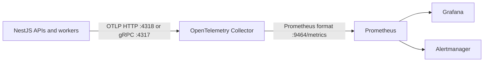

# Monitoring and Alerting

The repository's supported observability path is OpenTelemetry from backend
processes to an OpenTelemetry Collector. The collector exposes one
Prometheus-compatible endpoint. Backend APIs do not expose their own
`/metrics` routes.

## Request correlation

`ClsInterceptor` creates or preserves a request ID in Node
`AsyncLocalStorage`. Filters, interceptors, guards, services, controllers, and
middleware read the same value through `requestContext`; the response echoes it
as `x-request-id`. Use that ID to correlate logs and traces for one request.

## Metrics topology



The runtime SDK is owned by `libs/backend/common/otel/lib`. It exports metrics
with `OTLPMetricExporter` when OpenTelemetry is active. The collector pipeline
is defined in `docker/otel-collector-config.yaml`; its Prometheus exporter
listens on port `9464`. Docker Prometheus scrapes `otel-collector:9464`, and the
Helm `ServiceMonitor` targets the collector service rather than individual APIs.

## Enable application telemetry

Local Compose and production Compose already contain the collector. Enable the
SDK in each backend process with:

```env
OTEL_ENABLED=true
OTEL_EXPORTER_OTLP_ENDPOINT=http://otel-collector:4318
OTEL_METRIC_EXPORT_INTERVAL=60000
```

The base endpoint is expanded to `/v1/traces` and `/v1/metrics`. Signal-specific
endpoint and header variables are documented in
[the OpenTelemetry runbook](operations/otel.md). When the SDK is disabled, no
application telemetry reaches the collector.

## Prometheus scraping

The committed Docker configuration is the reference:

```yaml
scrape_configs:
  - job_name: 'otel-collector'
    static_configs:
      - targets: ['otel-collector:9464']
```

For another Prometheus installation, scrape the collector's `/metrics` path on
port `9464`. Keep this endpoint private; only the Compose edge or cluster
monitoring plane should reach it.

## Alerts and dashboards

- Docker alert rules live in `docker/prometheus/alert-rules.yml` and are loaded
  by `docker/prometheus/prometheus.yml`.
- Grafana provisioning lives under `docker/grafana/provisioning`.
- Kubernetes monitoring resources live in `.helm/templates/servicemonitor.yaml`
  and `.helm/templates/prometheusrule.yaml`.
- Recovery and failure-mode guidance lives in the
  [observability and disaster-recovery runbook](operations/observability-dr.md).

Treat metric names emitted by auto-instrumentation as versioned runtime output.
Before adding or changing an alert, enable telemetry in a representative
environment, inspect the collector endpoint, and verify the exact metric name
and labels. Do not document an intended custom metric as implemented until its
instrument and test exist.

## Availability checks

External monitors should use the public health endpoints, not the private
collector endpoint:

- `/live` verifies that the process is running.
- `/ready` verifies readiness dependencies.
- `/health` is the public aggregate health route.
- `/health/private` is operational detail and must stay protected from public
  ingress.

Use the final hostname derived for each selected app. For example, the user API
in per-app-domain mode is `https://user-app-api.example.com/ready`; in
single-domain mode its route is proxied beneath the selected apex topology.
See [Docker Compose Production](docker-compose-production.md) for the exact
domain contract.

## Validate the shipped configuration

```bash
pnpm run deploy:validate
pnpm run test:observability
```

`deploy:validate` renders the supported Compose, Helm, and GitOps forms without
deploying them. `test:observability` runs the repository's observability QA
gate; runtime-backed checks require the dependencies described in
[Modern QA](testing/modern-qa.md).
