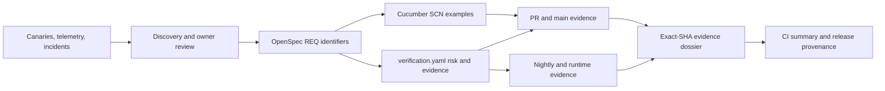

# Specification assurance

The repository uses a specification-driven assurance graph so maintainers can
review intent and evidence without treating thousands of implementation and test
lines as the primary product specification. It raises confidence; it does not
claim mathematical proof that the original requirement is correct or complete.

## Sources of truth

Each layer has one job:

| Layer                    | Canonical source                                     | Owns                                                              |
| ------------------------ | ---------------------------------------------------- | ----------------------------------------------------------------- |
| Normative behavior       | `openspec/specs/<capability>/spec.md`                | stable `REQ-*` requirements, invariants, failures, examples       |
| Discovery/change history | `openspec/changes/**` (optional)                     | proposals, counterexamples, design, verification policy, tasks    |
| Evidence mapping         | `openspec/specs/<capability>/verification.yaml`      | requirement-level projects, risk, Cucumber disposition, evidence  |
| Stakeholder examples     | `apps/e2e/acceptance/features/**/*.feature`          | declarative `@REQ-*` / `@SCN-*` Cucumber examples                 |
| Domain and failure rules | owning project Vitest suites                         | algorithms, state transitions, boundaries, negative paths         |
| Public API invariants    | OpenAPI, contract, property, and fuzz suites         | provider/consumer shape and generated-client compatibility        |
| User journeys            | Playwright projects                                  | behavior in the real browser or full product stack                |
| Runtime confidence       | component, security, mutation, and operations suites | infrastructure, adversarial, test-strength, and recovery evidence |

The layers are complementary. Do not restate every Vitest assertion in Gherkin
or hide stakeholder behavior inside low-level tests.

`openspec/changes/**` is transient working material and per-repository history,
not a canonical layer. Nothing in the assurance tooling reads it — a repository
with no `openspec/changes` directory is fully conformant. `openspec/changes/archive/**`
holds this boilerplate's own completed change sets; a product forked from here
should clear it rather than inherit three unrelated proposals. Requirements that
must survive live in `openspec/specs/**`, and decisions that must survive live in
[docs/adr](adr).



## Mechanical synchronization

`pnpm run spec:validate` fails when:

- an Nx project belongs to no durable requirement;
- a durable requirement lacks an evidence mapping;
- a mapped requirement does not exist in its spec;
- a requirement names an unknown project or the union of requirement scopes
  leaves a project unowned;
- an executable repository test lacks a `// @requirements REQ-...` marker,
  names an unknown requirement, or names a requirement that does not own its Nx
  project;
- a required evidence kind, owner, file, Nx target, or root script is missing;
- an evidence source does not explicitly name its `REQ-*` identifier;
- a requirement lacks a Cucumber disposition, or its disposition contradicts
  its profile and mapped evidence;
- a Cucumber `not-applicable` reason is empty, generic, duplicated, or names an
  alternative evidence kind absent from the requirement;
- a Cucumber feature or scenario lacks a valid mapping or stable tag;
- a scenario ID is duplicated;
- OpenSpec strict validation fails.

The trace report separates total and traced executable tests, Nx projects,
durable requirements, Cucumber features/scenarios, and selected high-signal
evidence. It also reports total dispositions, acceptance requirements,
not-applicable requirements, and their alternative evidence kinds. This
prevents either a small evidence manifest or an unexplained absence of Gherkin
from being presented as complete repository coverage.

Version 3 sidecars place ownership and exactly one Cucumber disposition on each
requirement:

```yaml
version: 3
capability: authentication-access
owners:
  product: identity-maintainers
  verification: quality-engineering
requirements:
  - id: REQ-AUTH-SESSION-002
    projects:
      - auth-app-api
      - '@app/backend-feature-auth-main'
    risk: critical
    profiles: [domain, persistence, security, journey]
    cucumber:
      disposition: not-applicable
      reason: Session enforcement is proven at the guard, persistence, and browser boundaries.
      alternativeEvidence: [vitest, component, playwright]
    evidence:
      - kind: vitest
        file: libs/backend/feature/auth/main/lib/src/interfaces/http/persistent-session-access.guard.spec.ts
        target: '@app/backend-feature-auth-main:test'
        lanes: [pr, main]
```

Use `disposition: acceptance` only with the `acceptance` profile and mapped
`kind: cucumber` scenario evidence. Use `disposition: not-applicable` only
without an acceptance profile or Cucumber evidence; its reason must explain why
another executable boundary is more faithful, and every named alternative kind
must exist in the same requirement's evidence. Placeholder or copied
rationales fail validation or review.

Every executable `*.spec.*`, `*.test.*`, `*.e2e-spec.*`, or
`*.component-spec.*` file under the repository-owned inventory roots has one
explicit marker near its top. Command modules whose product name happens to end
in `-test`, such as `storybook-test.ts`, are not test-suite files and are not
inventoried.

```ts
// @requirements REQ-AUTH-SESSION-002
```

The marker assigns the whole test file to durable behavior and is checked
against project ownership. It does not claim that every assertion is
high-signal evidence; selected evidence remains explicit in the sidecar.

`pnpm run spec:impact -- --base <rev> --head <rev>` maps changed specs,
evidence files, and project roots to requirements. Repository-global source,
configuration, workflow, and policy changes, including repository tooling
source, conservatively select every requirement; files inside ordinary Nx
project roots retain focused selection. Added, modified, renamed, and deleted
paths all participate in impact selection.

`pnpm run spec:verify` deduplicates the selected commands, executes one evidence
lane, and writes JSON plus Markdown under `test-results/spec-evidence/`. Every
dossier contains its source SHA and specification hash. A dry run is recorded as
`planned`, never `ok`. A passing dossier is refused from a dirty worktree,
because `HEAD` would not identify the source that actually executed.

## Evidence lanes

| Lane    | Invocation                                                            | Purpose                                                                      |
| ------- | --------------------------------------------------------------------- | ---------------------------------------------------------------------------- |
| PR      | `pnpm run spec:verify -- --lane pr --base origin/main --head HEAD`    | impacted deterministic acceptance, unit/security, and tooling evidence       |
| Main    | `pnpm run spec:verify -- --lane main --base <before-sha> --head HEAD` | impacted broader contracts and component evidence                            |
| Nightly | `pnpm run spec:verify -- --all --lane nightly`                        | mutation, property, component, resilience, recovery, and operations evidence |
| Runtime | `pnpm run spec:verify -- --all --lane runtime`                        | environment-bound fullstack Playwright journeys and canaries                 |

GitHub and GitLab run impacted PR/main evidence. GitHub also owns scheduled
nightly and manually dispatched runtime workflows. Required skips are failures;
an unavailable runtime is reported as an environment boundary, not converted
into a source-code pass.

## Writing or changing behavior

1. Start with `$specify-behavior` and create or update an OpenSpec change.
   Complete discovery with actors, positive examples, negative/boundary cases,
   authorization, concurrency, failure, observability, rollout, and rollback
   where applicable.
2. Add or modify the durable `REQ-*` requirement. The ID is stable across
   wording and implementation refactors.
3. Select proportional profiles in the version 3 `verification.yaml`.
   Critical/high risk requires an independent verification owner; security and
   operations profiles require their respective owners.
4. Classify every requirement. Select Cucumber `acceptance` and add declarative
   Gherkin for stakeholder-significant examples, with a `@REQ-*` tag on the
   feature/rule scope and one unique `@SCN-*` tag per scenario. Otherwise
   select `not-applicable`, record a requirement-specific reason, and name the
   mapped alternative evidence kinds.
5. Keep pure rules and failure matrices in Vitest, public compatibility in
   contract/property suites, and real journeys in Playwright. These layers are
   alternatives to Gherkin only when the requirement sidecar says so
   explicitly.
6. Implement approved artifacts through `$implement-specified-change`. Give
   every new executable test its requirement marker and update
   requirement-level project ownership, disposition, and evidence in the same
   revision.
7. Run `spec:validate`, `spec:impact`, and the impacted lane before handoff.
   Use `$review-specification-assurance` for independent completeness,
   evidence-quality, and exact-revision review.
8. Treat a new production incident, escaped defect, or missed canary as
   discovery input: update the requirement/example and add independent
   regression evidence.

## Cucumber contract

The `acceptance-e2e` Nx project uses Cucumber.js with TypeScript, a new World
instance per scenario, deterministic serial execution, and message, HTML, and
JUnit reports. Run:

```bash
pnpm exec nx run acceptance-e2e:typecheck
pnpm exec nx run acceptance-e2e:acceptance
```

The generic `test` target is safe inside repository-wide Nx test and coverage
commands: it does not forward Vitest-only flags to Cucumber, but it still runs
all scenarios and emits message, HTML, and JUnit execution evidence. Use the
explicit `acceptance` target when passing Cucumber-owned filters or profiles.

Cucumber evidence is never optional for a requirement whose disposition is
`acceptance`. Conversely, a `not-applicable` requirement cannot retain an
acceptance profile or Cucumber evidence. This makes omission explicit without
turning every unit, contract, property, component, or browser assertion into
Gherkin.

Write declarative scenarios in product language. Step definitions may call
public domain functions or system boundaries, but feature files should not name
buttons, CSS selectors, implementation classes, or internal method sequences
unless that interface is itself the requirement. Shared product logic never
belongs in the acceptance project.

Follow the official Cucumber guidance for
[Gherkin syntax](https://cucumber.io/docs/gherkin/reference),
[better Gherkin](https://cucumber.io/docs/gherkin/better-gherkin/), and
[hooks, tags, and execution APIs](https://cucumber.io/docs/cucumber/api/).
Feature files describe observable examples, not implementation scripts.

Generate another owned acceptance project only when a product truly needs a
separate boundary:

```bash
pnpm nrb add app payments-acceptance-e2e \
  --kind e2e \
  --renderer cucumber \
  --dry-run
```

Apply the same command without `--dry-run`, then replace the generated example
IDs and evidence mapping with product-owned requirements.

## What this cannot prove

No collection of tests can establish that humans asked for the right product or
enumerated every unknown scenario. This repository reduces that risk through:

- explicit owner discovery and unresolved-question gates;
- an independently reviewed discovery artifact with named assumptions and
  unresolved stakeholder decisions;
- independently owned evidence for high-risk behavior;
- counterexamples, boundary, authorization, concurrency, and failure review;
- property and mutation testing to challenge examples and assertions;
- runtime canaries, observability, exploratory review, and incident feedback;
- exact-SHA evidence so a good test result cannot authorize different code.

Confidence is therefore evidence-bounded: a green PR proves the declared PR
lane for that revision, while production readiness additionally needs the
required nightly/runtime evidence and operational approval.
